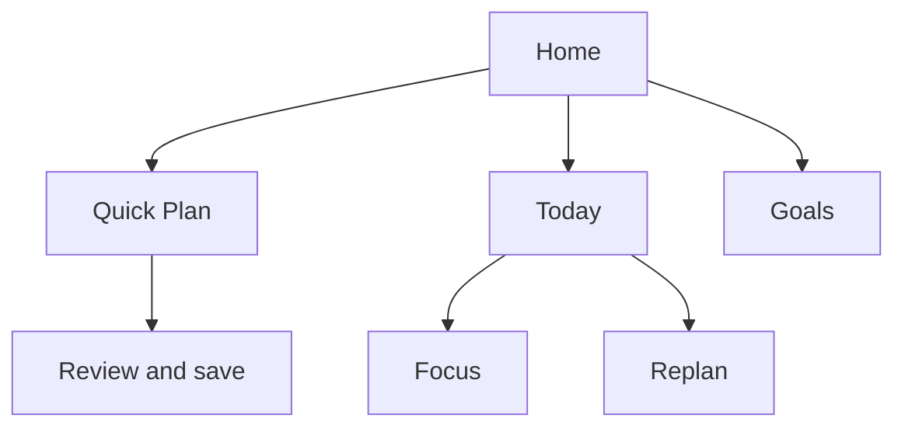
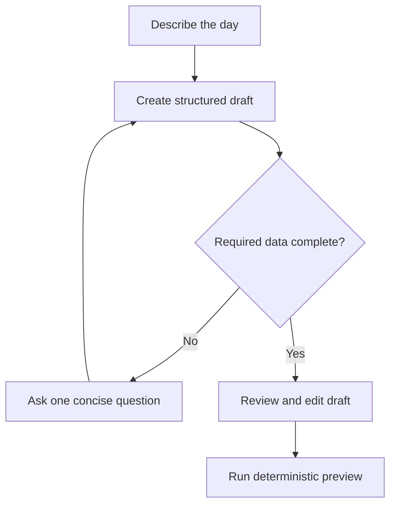
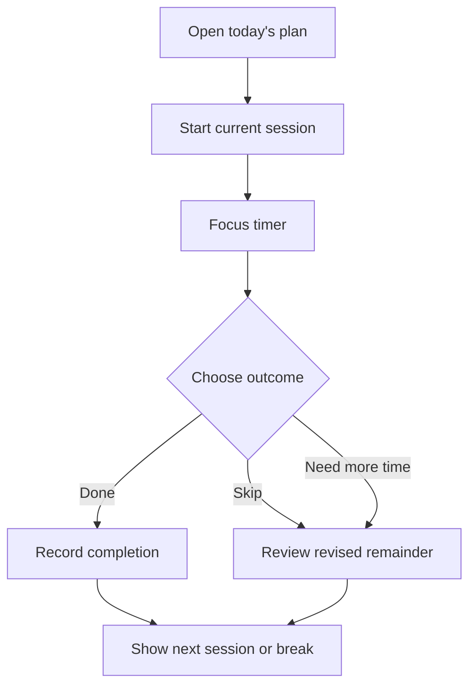

# UI/UX Design

## 1. User and design goals

| User/context | Goal | Pain point | Design response |
|---|---|---|---|
| User planning before study/work | Create a realistic plan quickly | Task lists hide whether work fits | Show capacity and feasibility before the timeline |
| User with an overloaded request | Decide what to change | Generic warnings create guilt but no action | Show the exact gap, affected tasks, and explicit recovery choices |
| User reviewing AI interpretation | Correct misunderstanding safely | AI can invent or misread constraints | Present a structured editable draft before scheduling |
| User executing a session | Know what to do now | A full-day timeline can feel distracting | Emphasize the current session, next break, and one primary action |
| User whose day changed | Recover without rebuilding everything | Traditional plans become obsolete | Preserve completed history and explain the revised remainder |

## 2. Experience principles

- Mr. Bloom is an old AI robot and the central conversational guide: mature, calm, practical, concise, assertive when a plan is unrealistic, supportive without excessive enthusiasm, and non-judgmental when the user falls behind.
- His distant-future plant-restoration mission may appear as concise atmosphere, never as customization, a pet system, quests, a campaign, or multiple agents.
- Calm, direct, and non-judgmental language.
- Capacity truth before productivity pressure.
- Generated output is always reviewable and editable.
- Timeline views render the backend's single ordered `PlanBlock[]`, including unchanged `FIXED_EVENT` blocks; the frontend does not reconstruct fixed events separately.
- One primary action per state.
- Errors identify what happened, why it matters, and how to recover.
- Progress is not erased because the plan changed.

## 3. Information architecture

The three main screens are **Home / Mr. Bloom**, **Today**, and **Goals**. Home includes conversation, Quick Plan, upcoming reminder, the active plant, Water Reserve, and shortcuts; Today owns timeline/focus/recovery; Goals owns roadmaps and milestone actions. Authentication and Settings support them. There is no separate Garden screen in the MVP.

## 4. User flows

### Structured Quick Plan

### Conversational planning

### Focus and re-plan

## 5. Screen and state inventory

| Screen/state | Purpose | Main actions | Loading, empty, and error behavior |
|---|---|---|---|
| Home | Enter the core loop | Quick Plan, open Today | Empty state explains the first planning action |
| Quick Plan — input | Capture structured request | Set window, tasks, events, preferences; generate | Inline validation preserves entered data |
| Quick Plan — generating | Confirm work is in progress | Cancel if supported | Skeleton/indicator; controls avoid duplicate submit |
| Quick Plan — review | Explain feasibility and timeline | Save, edit inputs, regenerate | Empty timeline distinguishes no tasks from unscheduled work |
| Overload resolution | Make capacity trade-offs explicit | Defer/remove, reduce estimate, extend window, change splitting | Shows before/after totals and preserves last valid preview |
| Conversational draft | Review AI interpretation | Correct fields, answer clarification, preview | Timeout offers retry and manual form |
| Today's Plan | Orient the user to now and next | Start, edit, re-plan | Missed session is presented as recoverable, not failure |
| Focus | Execute one session | Pause, resume, `DONE`, `FINISHED_EARLY`, `NEED_MORE_TIME`, `SKIP` | Recovered timer states show restored timestamp and current result |
| Re-plan review | Explain changes | Accept or manually revise | Protected completed history is visually separated |
| Goals | View goals, roadmap, milestones, and reminder state | Create/edit/move milestone; choose reminder action | Downstream-date warning; creating a Daily Plan requires confirmation |
| Plant status | Show the integrated active plant and Water Reserve | View status; configure Rest Mode in Settings | No inventory; missed tasks use recovery language, not damage language |

## 6. Quick Plan layout

### Desktop

- Left column: date/window, task list, fixed events, and collapsed preferences.
- Right column: capacity summary, generated timeline, warnings, and unscheduled work.
- Primary button: **Generate plan** before preview, then **Save plan** after a valid preview.

### Mobile

- Single-column progressive layout: time → tasks → events → preferences → preview.
- Capacity summary appears before timeline.
- Editing returns to the relevant section without clearing other inputs.

## 7. Content rules

| Situation | Preferred content | Avoid |
|---|---|---|
| Overload | “You need 45 more minutes. Two optional tasks are not scheduled.” | “You failed to plan realistically.” |
| Invalid duration | “Duration must be at least 1 minute.” | “Invalid input.” |
| AI uncertainty | “How long should ‘review notes’ take?” | Inventing a default without disclosure |
| Skipped session | “Skip recorded. Re-plan the remaining day?” | Removing history or rewards |
| Milestone reminder | “Tomorrow is the deadline. Create tomorrow's plan for the remaining work?” | Adding tasks without confirmation |
| Rest Mode | “Rest Mode pauses Water Reserve decay and growth until you return.” | Treating rest as failure |
| Partial result | “Here is the work that fits safely.” | Presenting a partial plan as complete |

## 8. Design system foundations

| Area | Initial decision |
|---|---|
| Visual direction | Soft botanical identity with high-contrast functional surfaces |
| Status | Comfortable, Tight, and Overloaded use icon + text + color, never color alone |
| Typography | Readable sans-serif; minimum 16 px body text on core forms |
| Spacing/radius | Consistent 4/8 px spacing scale and moderate rounded cards |
| Responsive rules | 360–767 px single column; 768 px and above may use input/preview split |
| Motion | Short functional transitions; honor reduced-motion preference |
| Content tone | Honest, concise, encouraging, and non-clinical |

Specific color tokens and visual assets will be finalized during UI implementation; no untested contrast values are claimed here.

## 9. Accessibility and usability checklist

- [ ] Keyboard order follows visual order.
- [ ] Every task/event row has an accessible name and non-drag editing controls.
- [ ] Errors are associated with fields and summarized after submit.
- [ ] Timeline information is available as text, not position/color alone.
- [ ] Status changes and timer completion use visible text; sound is optional.
- [ ] Loading, empty, validation, overload, partial, and recovery states are implemented.
- [ ] Focus is moved intentionally after validation and dynamic content updates.
- [ ] Critical controls meet touch-target and contrast requirements.

## 10. Validation plan

The first usability walkthrough will test whether a user can create a five-task plan within two minutes, explain the feasibility result, find unscheduled work, and recover from one invalid duration. Findings will update this document before release rather than being invented in advance.
