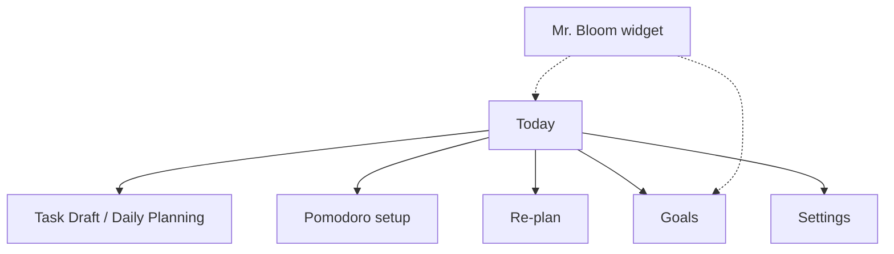
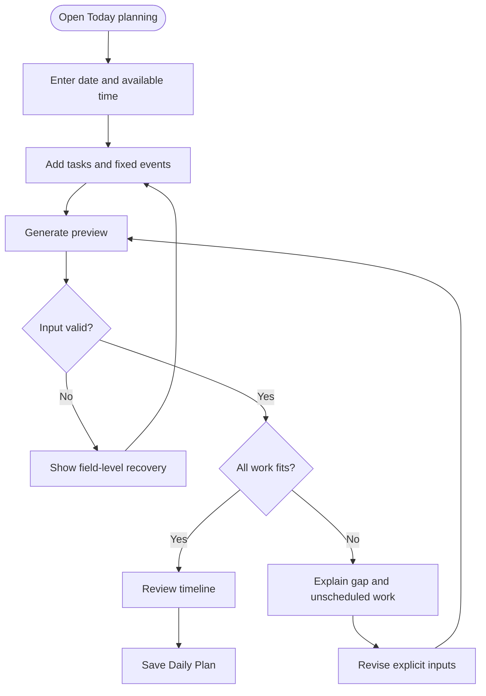
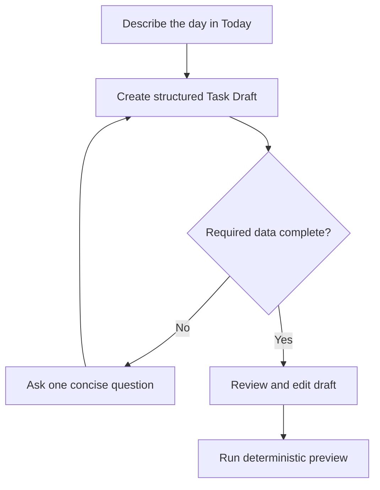
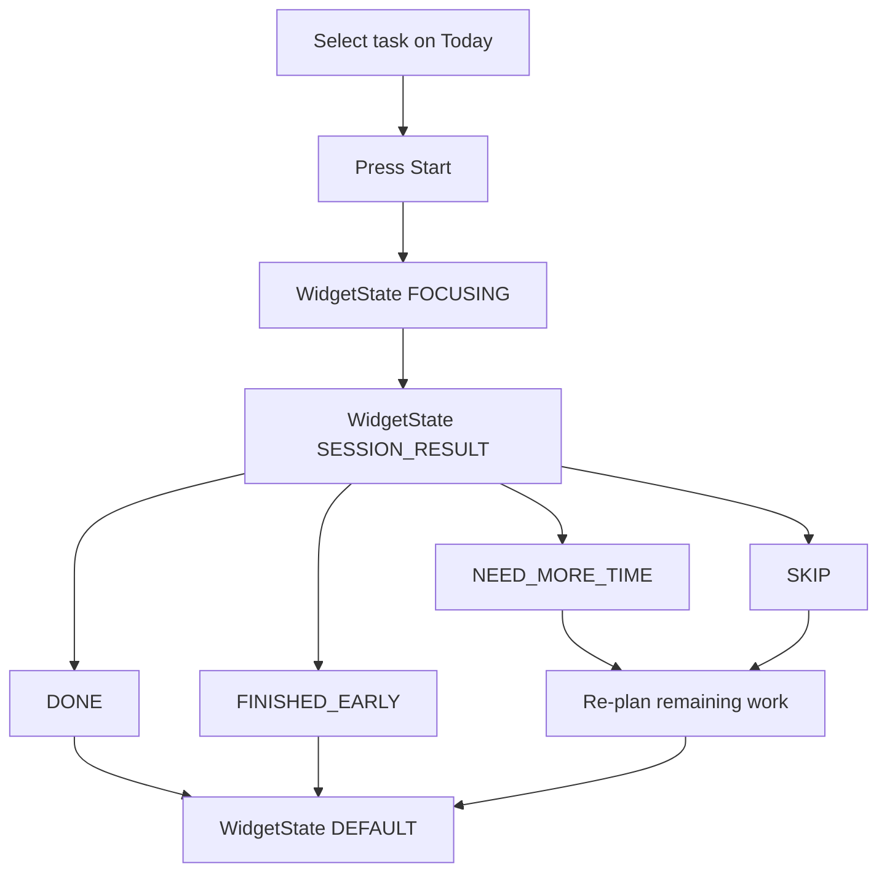
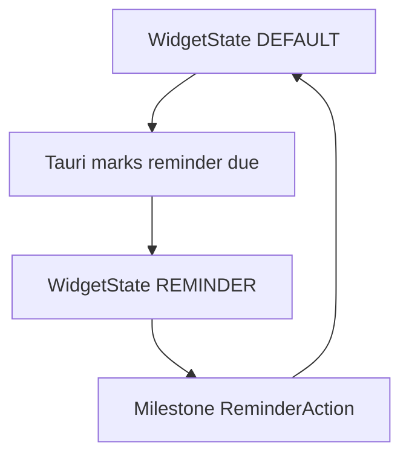

# UI/UX Design

This document distinguishes full-application screens, widget functional states, visual context, reusable components, and plant artwork. Time × weather combinations are composed layers, not separate product screens.

## 1. User and design goals

| User/context | Goal | Pain point | Design response |
|---|---|---|---|
| User planning before study/work | Create a realistic Daily Plan quickly | Task lists hide whether work fits | Show capacity and feasibility before the timeline |
| User with an overloaded request | Decide what to change | Generic warnings create guilt but no action | Show the exact gap, affected tasks, and explicit recovery choices |
| User reviewing AI interpretation | Correct misunderstanding safely | AI can invent or misread constraints | Present a structured editable Task Draft before scheduling |
| User executing a session | Know what to do now | A full-day timeline can feel distracting | Select a task in Today; follow countdown on the widget |
| User whose day changed | Recover without rebuilding everything | Traditional plans become obsolete | Preserve completed history and explain the revised remainder |
| User keeping Blooming nearby | Stay present without a full window | OS toasts and chatbots interrupt | Compact widget, tray red-dot, dismissible bubbles, quiet hours |

## 2. Experience principles

- Mr. Bloom is a small robot cat and Blooming's visual identity: warm, concise, occasionally enthusiastic, and honest about unrealistic plans.
- Planning is the product core. The widget is a supporting desktop surface, not a companion chatbot, pet, or shop.
- Planning chat exists only in the full application. The widget has no free-form chat.
- Capacity truth before productivity pressure.
- Generated output is always reviewable and editable.
- Timeline views render the backend's single ordered `PlanBlock[]`, including unchanged `FIXED_EVENT` blocks; the frontend does not reconstruct fixed events separately.
- Each WidgetState should emphasize one clear primary action when appropriate, while secondary contextual actions remain compact and visually subordinate.
- Errors identify what happened, why it matters, and how to recover.
- Heart Progress is not erased because the plan changed.
- Time and weather change ambience only. They never change scheduler decisions, task priority, reminder timing, or Heart Progress.

## 3. Information architecture

Full-application screens are **Today**, **Goals**, and **Settings**. The application opens on Today. Authentication supports them. There is no Home screen, separate chat screen, or Garden screen in the MVP.

The Mr. Bloom widget is a separate always-on-top window, not a fourth application screen.

## 4. User flows

### Structured Daily Planning

### Conversational planning

### Focus and re-plan

Outcome selection happens in `SESSION_RESULT`, not before it. `FINISHED_EARLY` means the intended work was completed early; it returns to `DEFAULT` and does not automatically trigger re-planning.

### Reminder on widget

Milestone ReminderAction values are `CREATE_PLAN`, `MARK_COMPLETED`, `MOVE_MILESTONE`, and `REMIND_LATER`. Focus/task widget actions `START_FOCUS` and `OPEN_BLOOMING` are a separate action set.

## 5. Full-application screens

| Screen | Purpose | Main actions | Loading, empty, and error behavior |
|---|---|---|---|
| Today | Plan, review timeline, select a task, set Pomodoro, re-plan | Create/edit Task Draft, generate/save Daily Plan, start focus, recover remaining day | Empty state explains the first planning action; missed session is recoverable |
| Task Draft / Daily Planning | Capture structured or conversational request (region of Today, not a separate IA root) | Set window, tasks, events, preferences; generate | Inline validation preserves entered data |
| Daily Plan review | Explain feasibility and timeline | Save, edit inputs, regenerate | Empty timeline distinguishes no tasks from unscheduled work |
| Overload resolution | Make capacity trade-offs explicit | Defer/remove, reduce estimate, extend window, change splitting | Shows before/after totals and preserves last valid preview |
| Conversational draft | Review AI interpretation | Correct fields, answer clarification, preview | Timeout offers retry and manual form |
| Focus setup | Start one session from Today | Choose preset `25/5` or `50/10` or custom; Start | Timer display recovers from persisted timestamps |
| Re-plan review | Explain changes | Accept or manually revise | Protected completed history is visually separated |
| Goals | View Goal, Roadmap, Milestone, and Reminder state | Create/edit/move milestone; choose reminder action | Downstream-date warning; creating a Daily Plan requires confirmation |
| Settings | Account, timezone, focus defaults, quiet hours, launch-on-startup, widget visibility, always-on-top, Mr. Bloom display name, PlantType, weather-aware visuals, city or coarse location | Save preferences | Invalid timezone/location is field-level; weather fetch failure does not block saving other settings |
| Authentication | Register, login, logout | Submit credentials | Errors do not reveal whether an email/username exists beyond a generic failure |

## 6. Widget functional states

These are WidgetState values, not application screens.

| WidgetState | Purpose | Main actions | Notes |
|---|---|---|---|
| `DEFAULT` | Clock, greeting, miniature garden, current time | Open Blooming; optional compact next-up | Ambient layers still apply |
| `REMINDER` | Due Reminder bubble | Milestone ReminderAction: `CREATE_PLAN`, `MARK_COMPLETED`, `MOVE_MILESTONE`, `REMIND_LATER`. Focus/task actions: `START_FOCUS`, `REMIND_LATER`, `OPEN_BLOOMING` | Tray red-dot remains while unread |
| `FOCUSING` | Active Pomodoro countdown | Pause, resume, end | FastAPI stores timestamps; Tauri calculates remaining time |
| `SESSION_RESULT` | Choose the session outcome | `DONE`, `FINISHED_EARLY`, `NEED_MORE_TIME`, `SKIP` | `DONE` and `FINISHED_EARLY` return to `DEFAULT` without automatic re-planning; `NEED_MORE_TIME` and `SKIP` re-plan then return to `DEFAULT` |
| `HIDDEN` | Widget window destroyed | Reveal from tray; Quit Blooming exits | Unread due reminders are retained |

Typical flows: `DEFAULT → REMINDER → DEFAULT`; `DEFAULT → FOCUSING → SESSION_RESULT → DONE → DEFAULT`; `DEFAULT → FOCUSING → SESSION_RESULT → FINISHED_EARLY → DEFAULT`; `DEFAULT → FOCUSING → SESSION_RESULT → NEED_MORE_TIME` or `SKIP` → re-plan → `DEFAULT`.

## 7. Widget visual context

WidgetContext contains local time-of-day and optional WeatherContext. It remains independent from WidgetState.

The rendered widget composes WidgetState + WidgetContext + PlantType/GardenState.

Time-of-day: `MORNING`, `AFTERNOON`, `EVENING`, `NIGHT` (resolved locally from the configured timezone).

WeatherContext: `CLEAR`, `CLOUDY`, `RAINY`, `STORMY`, `FOGGY`, `SNOWY`, `UNKNOWN`.

Time and weather may affect background, ambient lighting, weather overlays, greeting, decorative effects, and minor Mr. Bloom or garden presentation. They must not be documented or implemented as unique screens or unique plant assets per combination.

If weather-aware visuals are disabled, compose time-only WidgetContext with no weather overlay; WeatherContext is not required to be `UNKNOWN`. If weather is unavailable or invalid, WeatherContext may be `UNKNOWN` and the UI still uses time-only presentation.

Example composition, not a separate screen: `REMINDER` + `NIGHT` + `RAINY`.

## 8. Reusable components and plant visuals

| Kind | Examples |
|---|---|
| Full-app components | Timeline of `PlanBlock[]`, Reality Check badge, Task Draft form, Focus controls, Goal/Milestone list |
| Widget layers | Background, lighting, weather overlay, greeting, Mr. Bloom sprite, garden miniature, chat bubble, compact actions |
| Plant visual variants | Artwork for each PlantType (`POTHOS`, `CACTUS`, `BONSAI`, `SUNFLOWER`, `LOTUS`) at each GardenState stage (`DORMANT`, `SPROUTING`, `GROWING`, `BLOOMING`, `FLOURISHING`) |

Switching PlantType changes artwork only. Heart Progress, GardenState stage, and history stay put. There is no plant inventory, shop, or Water Reserve meter.

## 9. Layout

### Full application (desktop)

- Typical window widths 1024–1920 px.
- Today: planning/chat and Task Draft with capacity summary and timeline; current/next session and garden visual remain visible.
- Goals: roadmap list and reminder actions.
- Settings: grouped preferences, including PlantType and weather-context controls.

### Widget

- Compact always-on-top window.
- Compose layers rather than shipping a unique layout per time × weather × state.

The MVP has no mobile application layout.

## 10. Content rules

| Situation | Preferred content | Avoid |
|---|---|---|
| Overload | “You need 45 more minutes. Two optional tasks are not scheduled.” | “You failed to plan realistically.” |
| Invalid duration | “Duration must be at least 1 minute.” | “Invalid input.” |
| AI uncertainty | “How long should ‘review notes’ take?” | Inventing a default without disclosure |
| Skipped session | “Skip recorded. Re-plan the remaining day?” | Removing history or Heart Progress |
| Milestone reminder | “Tomorrow is the deadline. Confirm a Daily Plan for the remaining work?” | Adding tasks without confirmation |
| Weather unavailable | Time-of-day greeting and lighting continue | Blocking the widget or changing task order |
| Plant switch | Artwork updates; growth is unchanged | Resetting Heart Progress or implying a new garden |
| Partial result | “Here is the work that fits safely.” | Presenting a partial plan as complete |

## 11. Design system foundations

| Area | Initial decision |
|---|---|
| Visual direction | Soft botanical identity with high-contrast functional surfaces |
| Status | Comfortable, Tight, and Overloaded use icon + text + color, never color alone |
| Typography | Readable sans-serif; minimum 16 px body text on core forms |
| Spacing/radius | Consistent 4/8 px spacing scale and moderate rounded cards |
| Responsive rules | Full app for desktop windows; widget is a compact overlay |
| Motion | Short functional transitions; honor reduced-motion preference |
| Content tone | Warm, concise, occasionally enthusiastic, honest about overload |

Specific color tokens and visual assets will be finalized during UI implementation; no untested contrast values are claimed here.

## 12. Accessibility and usability checklist

- [ ] Keyboard order follows visual order in the full application.
- [ ] Every task/event row has an accessible name and non-drag editing controls.
- [ ] Errors are associated with fields and summarized after submit.
- [ ] Timeline information is available as text, not position/color alone.
- [ ] Status changes and timer completion use visible text; sound is optional.
- [ ] Loading, empty, validation, overload, partial, and recovery states are implemented.
- [ ] Widget bubbles are dismissible and honor quiet hours.
- [ ] Weather and time variants do not rely on color alone for meaning.
- [ ] Critical controls meet contrast requirements.
