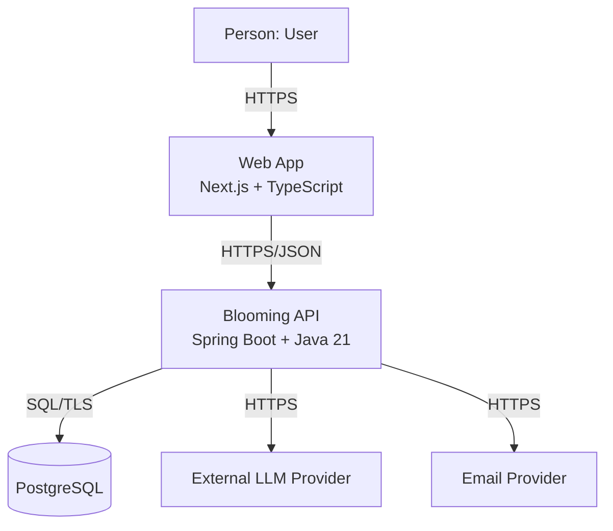
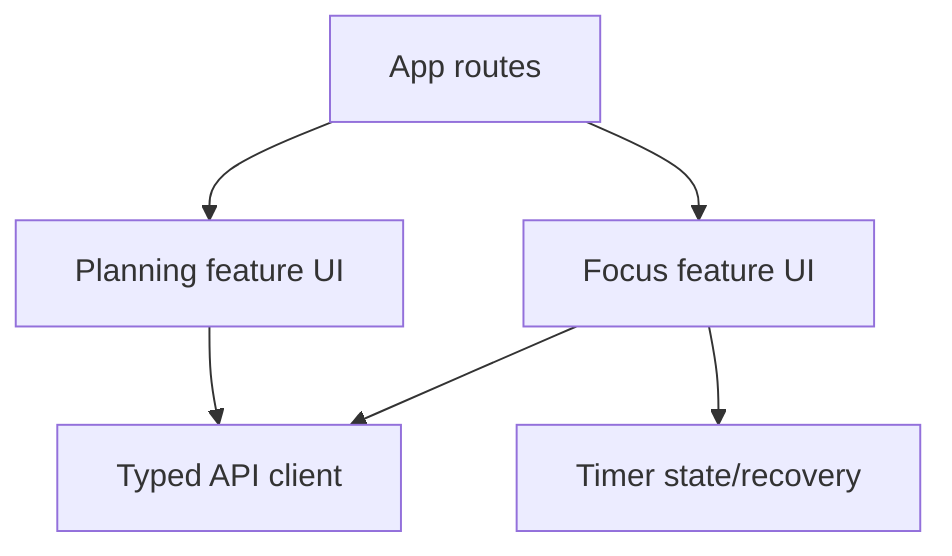
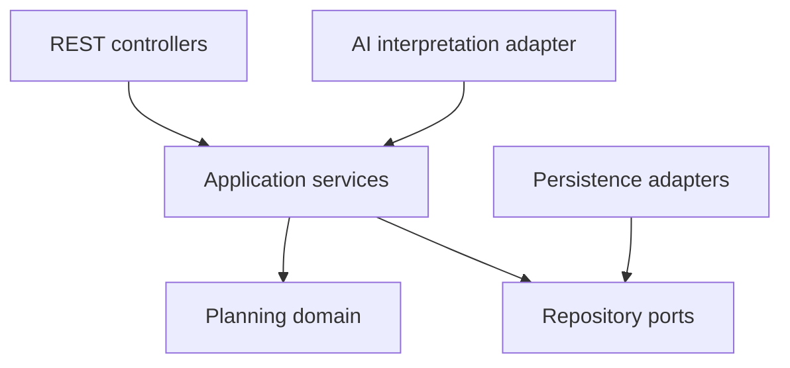
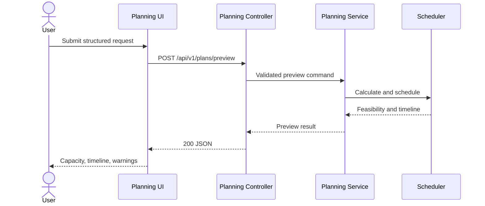

# Container and Component Architecture

## 1. C4 Level 2 — Containers

| Container | Responsibility/services | Technology | Data owned | Communication |
|---|---|---|---|---|
| Web App | Render planning/focus UI, collect input, maintain presentation state, call API | Next.js, React, TypeScript | Ephemeral form/view state; no authoritative plan data | HTTPS/JSON to API |
| Blooming API | Validate input, calculate/schedule/re-plan, orchestrate persistence, protect AI boundary | Spring Boot, Java 21 | Authoritative business behavior; persisted through repositories | REST/JSON, SQL, provider HTTPS |
| PostgreSQL | Store users/settings, plans, tasks, PlanBlocks, FocusRuns, goals/reminders, and plant/activity state | PostgreSQL | Durable product data | SQL over encrypted provider connection |
| LLM Provider | Interpret natural language into a draft schema | Selected and privacy-reviewed before conversational integration | Provider processing only; no Blooming source of truth | HTTPS request/response |
| Email Provider | Deliver basic milestone reminder email | One provider, selected before reminder integration | Delivery metadata only; no Blooming source of truth | HTTPS request/response |

## 2. Frontend components

| Component | Responsibility | Dependencies | Planned code location |
|---|---|---|---|
| App routes/layout | Navigation, shared layout, error boundaries | Feature UIs | `frontend/src/app/` |
| Planning feature UI | Input, validation display, capacity summary, and direct rendering of the ordered PlanBlock timeline including unchanged fixed events; no client-side event reconstruction | API client, UI components | `frontend/src/features/planning/` |
| Focus feature UI | Current session, timer controls, outcomes | API client, timer state | `frontend/src/features/focus/` |
| Goals and plant UI | Roadmap/reminder actions and integrated plant/Water Reserve display | API client | `frontend/src/features/goals/`, `frontend/src/features/plant/` |
| Typed API client | Request/response serialization and error mapping | Generated/manual contracts | `frontend/src/lib/api/` |
| Timer state/recovery | Derive timer display from persisted timestamps and current clock | Focus API | `frontend/src/features/focus/timer/` |

## 3. Backend components

| Component | Responsibility | Dependencies | Planned code location |
|---|---|---|---|
| Planning controller | Map HTTP preview/save/edit/re-plan requests and errors | Application services, DTO validation | `backend/src/main/java/.../planning/api/` |
| Planning application service | Coordinate validation, scheduler, repositories, and transactions | Domain services, repository ports | `.../planning/application/` |
| Scheduling domain | Normalize intervals, preserve fixed events in output, calculate exact Break demand, enforce deadlines, validate/lock fixed Tasks, place flexible work, and verify invariants | Java domain types only | `.../planning/domain/` |
| Planning persistence adapter | Map domain records to PostgreSQL/JPA entities | Repository ports, JPA | `.../planning/infrastructure/persistence/` |
| AI interpretation adapter | Call provider and map untrusted output into draft DTO | Provider client, schema validator | `.../planning/infrastructure/ai/` |
| Focus module | Manage execution state, timer events, and outcomes | Clock port, repositories | `.../focus/` |
| Goal/reminder modules | Manage roadmaps, local-time reminders, notifications, and idempotent delivery | repositories, clock, email adapter | `.../goal/`, `.../reminder/`, `.../notification/` |
| Plant/activity modules | Calculate plant state/Water Reserve and persist meaningful activity, rewards, and Rest Periods | clock, repositories, transactions | `.../plant/`, `.../activity/`, `.../reward/` |

## 4. Preview runtime flow

The preview flow does not read or write PostgreSQL and does not call the LLM provider.

## 5. Dependency rules

- Domain code may depend only on domain types and standard language libraries.
- API, JPA, LLM, and framework annotations must not appear in scheduling domain classes.
- Application services depend on repository/clock/provider interfaces; infrastructure implements them.
- Frontend feature components use the typed API client rather than issuing inconsistent ad-hoc requests.
- The AI adapter may produce a planning draft but cannot invoke or replace domain rules internally.
- Logical modules are `auth`, `user`, `settings`, `chat`, `ai`, `task`, `plan`, `scheduler`, `focus`, `replanning`, `goal`, `milestone`, `reminder`, `notification`, `plant`, `reward`, and `activity`; they are modules within one deployment, not microservices.
- Cross-module changes use explicit application interfaces/events; modules do not reach into another module's persistence entities.

## 6. Consistency check

- [ ] Replace planned paths with actual package names after initialization.
- [ ] Confirm components map to real modules before each architecture update.
- [ ] Add only implemented modules to the production diagram.
- [x] Preview is isolated from persistence and LLM concerns.
