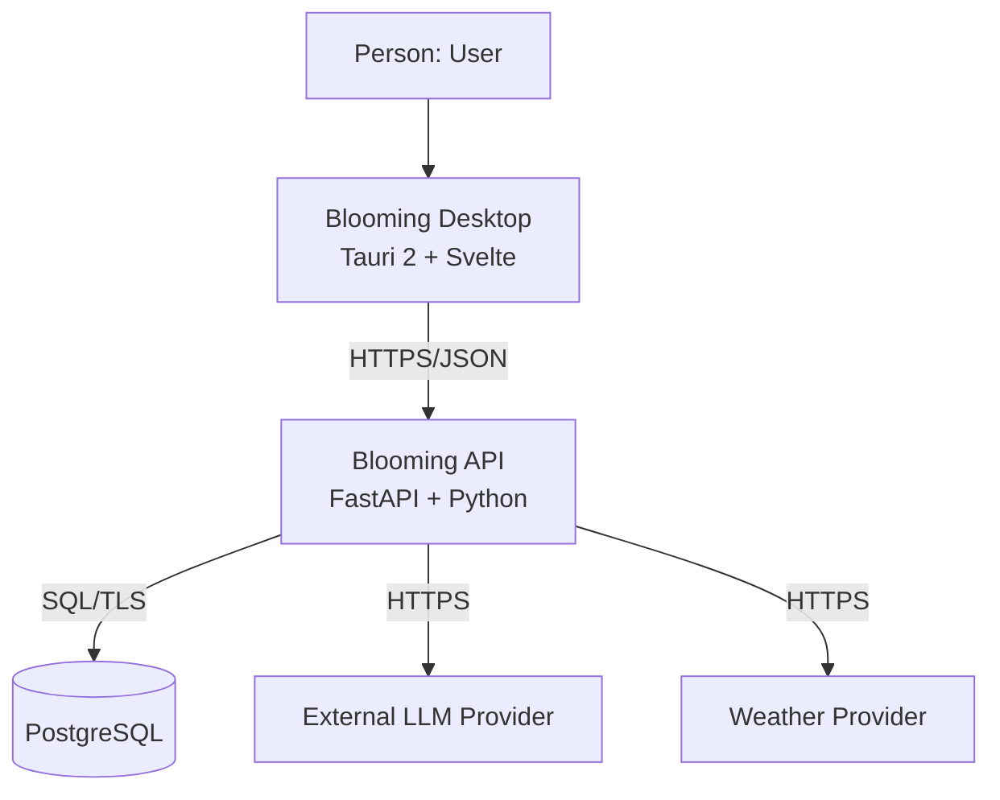
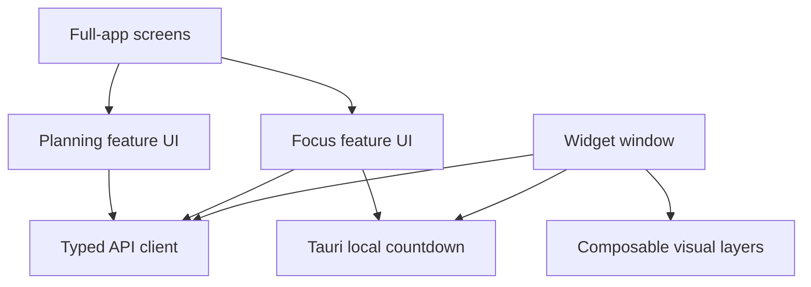
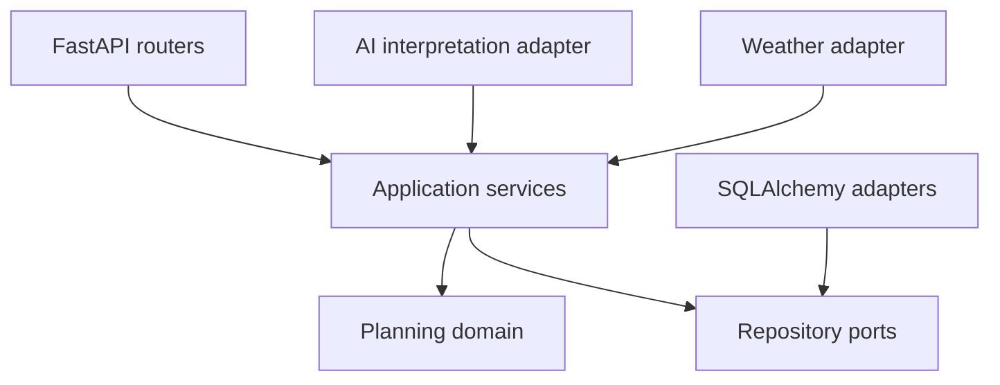
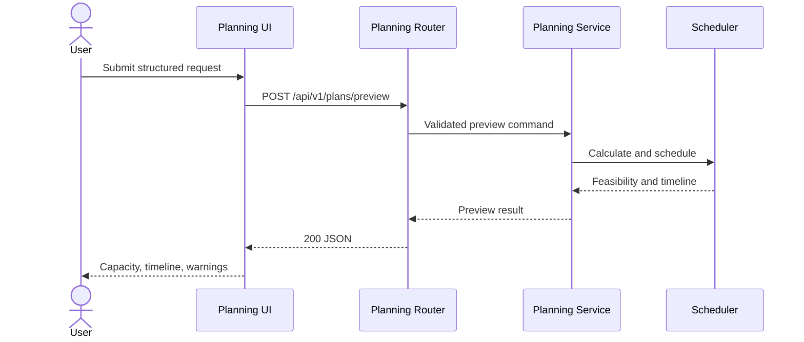
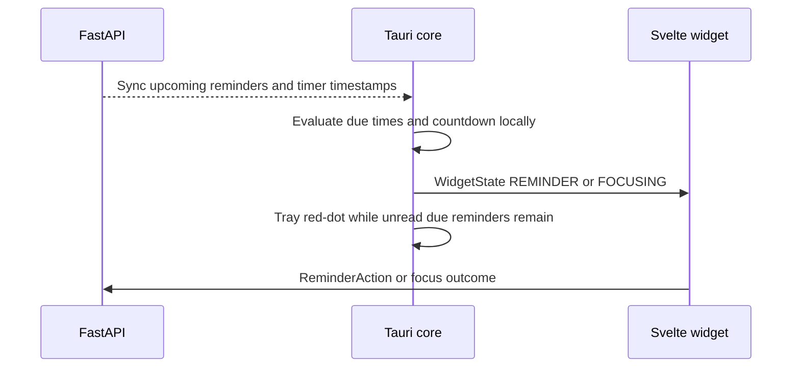

# Container and Component Architecture

## 1. C4 Level 2 — Containers

| Container | Responsibility/services | Technology | Data owned | Communication |
|---|---|---|---|---|
| Blooming Desktop | Render Today/Goals/Settings and the widget; collect input; compose time/weather layers; calculate countdown and reminder due times locally | Tauri 2, Rust, Svelte, TypeScript, Vite | Ephemeral UI state; synchronized reminder/timer/WeatherContext cache; no authoritative plan data | HTTPS/JSON to API; local tray/widget |
| Blooming API | Validate input, calculate/schedule/re-plan, orchestrate persistence, protect AI and weather boundaries | FastAPI, Python, Pydantic, SQLAlchemy | Authoritative business behavior; persisted through repositories | REST/JSON, SQL, provider HTTPS |
| PostgreSQL | Store users/settings, DailyPlans, Tasks, PlanBlocks, FocusRuns, Goals, Reminders, HeartEvents, GardenState, PlantType, WeatherSnapshot | PostgreSQL | Durable product data | SQL over encrypted provider connection |
| LLM Provider | Interpret natural language into a draft schema | Selected and privacy-reviewed before conversational integration | Provider processing only; no Blooming source of truth | HTTPS request/response |
| Weather Provider | Current conditions for WeatherContext | Selected before weather-aware visuals are enabled | No Blooming source of truth; FastAPI caches at most one current WeatherSnapshot per user | HTTPS request/response |

## 2. Frontend components

| Component | Responsibility | Dependencies | Planned code location |
|---|---|---|---|
| Full-app screens | Today, Goals, Settings navigation and layout | Feature UIs | `frontend/src/` application routes |
| Planning feature UI | Task Draft, validation display, capacity summary, and direct rendering of the ordered PlanBlock timeline including unchanged fixed events | API client, UI components | `frontend/src/features/planning/` |
| Focus feature UI | Task selection, Pomodoro setup, outcomes | API client, Tauri timer | `frontend/src/features/focus/` |
| Goals UI | Roadmap and ReminderAction | API client | `frontend/src/features/goals/` |
| Garden presentation | Map PlantType + GardenState stage to artwork | API client | `frontend/src/features/garden/` |
| Widget UI | WidgetState machine plus independent time/weather/plant layers | Tauri events, API client | `frontend/src/features/widget/` |
| Typed API client | Request/response serialization and error mapping | Generated/manual contracts | `frontend/src/lib/api/` |
| Tauri core | Tray red-dot, window lifecycle, local countdown, local reminder due times, local time-of-day | FastAPI sync payloads | `src-tauri/` |

Planned paths are conceptual. Replace them with actual module names after the desktop frontend is initialized.

## 3. Backend components

| Component | Responsibility | Dependencies | Planned code location |
|---|---|---|---|
| Planning router | Map HTTP preview/save/edit/re-plan requests and errors | Application services, Pydantic validation | `backend/app/planning/` |
| Planning application service | Coordinate validation, scheduler, repositories, and transactions | Domain services, repository ports | `backend/app/planning/` |
| Scheduling domain | Normalize intervals, preserve fixed events in output, calculate exact Break demand, enforce deadlines, validate/lock fixed Tasks, place flexible work, and verify invariants | Python domain types only | `backend/app/planning/domain/` |
| Planning persistence adapter | Map domain records to PostgreSQL/SQLAlchemy models | Repository ports, SQLAlchemy | `backend/app/db/` |
| AI interpretation adapter | Call provider and map untrusted output into draft DTO | Provider client, schema validator | `backend/app/ai/` |
| Focus module | Manage execution state, timer timestamps, and outcomes | Clock port, repositories | `backend/app/focus/` |
| Goal/reminder modules | Manage roadmaps, Reminder definitions/state, and ReminderAction persistence | repositories, clock | `backend/app/goals/`, `backend/app/reminders/` |
| Garden/heart modules | Persist HeartEvent, GardenState, and PlantType | repositories, transactions | `backend/app/garden/` |
| Weather module | Fetch, normalize, and cache WeatherSnapshot | weather client, cache | `backend/app/weather/` |

## 4. Preview runtime flow

The preview flow does not read or write PostgreSQL and does not call the LLM or weather provider.

## 5. Reminder and timer runtime

FastAPI never receives one request per second.

## 6. Dependency rules

- Domain code may depend only on domain types and standard language libraries.
- FastAPI, SQLAlchemy, LLM, and weather client types must not appear in scheduling domain modules.
- Application services depend on repository/clock/provider interfaces; infrastructure implements them.
- Frontend feature components use the typed API client rather than issuing inconsistent ad-hoc requests.
- The AI adapter may produce a planning draft but cannot invoke or replace domain rules internally.
- WeatherContext is presentation data. It must not be an input to the scheduler, reminder due-time logic, or Heart Progress.
- Logical modules are `auth`, `user`, `settings`, `planning`, `scheduler`, `focus`, `replanning`, `goal`, `milestone`, `reminder`, `garden`, `weather`, and `ai`; they are modules within one FastAPI deployment, not microservices.
- Cross-module changes use explicit application interfaces; modules do not reach into another module's persistence models.

## 7. Consistency check

- [ ] Replace planned paths with actual package names after initialization.
- [ ] Confirm components map to real modules before each architecture update.
- [ ] Add only implemented modules to the production diagram.
- [x] Preview is isolated from persistence, LLM, and weather concerns.
