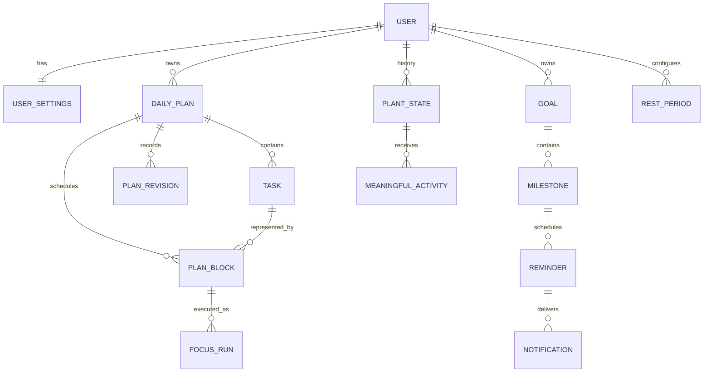

# Data and API Design

## Conventions

- Backend-generated UUIDs identify persistent records; timestamps are ISO 8601 with offsets and are stored as UTC instants.
- Each user, DailyPlan, and reminder retains its IANA timezone/local date context. Intervals are start-inclusive/end-exclusive; scheduling precision is whole minutes.
- JWT is required for user-owned endpoints. Server-side ownership and validation apply before every persistence operation.
- State-changing AI data is strict structured output and passes the same validation as form data.

## Domain relationships

`Task` describes work, `PlanBlock` schedules a portion of it, `FocusRun` records actual execution, and `PlanRevision` records a meaningful recovery. Planned and actual duration are never one field.

## Key persisted fields and enums

| Entity | Required responsibility / key fields |
|---|---|
| `User`, `UserSettings` | Identity, password hash, timezone, focus/break defaults, email-reminder enablement, Rest Mode configuration. |
| `Conversation`, `Message` | User-owned conversational context; persist the minimum necessary and never treat model output as authority. Intent values are `CREATE_DAILY_PLAN`, `EDIT_DAILY_PLAN`, `CREATE_GOAL`, `EDIT_ROADMAP`, `REPLAN`, `EXPLAIN_PLAN`, or `GENERAL_RESPONSE`. |
| `Task`, `DailyPlan` | Task estimate, priority, optional latest-finish deadline, core-or-optional and fixed-or-flexible classifications, fixed start for fixed Tasks, dependencies; plan date, windows, settings snapshot, and feasibility. |
| `PlanBlock`, `PlanRevision`, `FocusRun` | Block type `FOCUS`/`BREAK`/`FIXED_EVENT`; locked flag for fixed-Task Focus blocks; protected revision history; FocusRun timestamps, pauses, planned reference, actual elapsed time, and `DONE`/`FINISHED_EARLY`/`NEED_MORE_TIME`/`SKIP`. |
| `Goal`, `Milestone` | Goal outcome/target/progress; milestone expected outcome, deadline, order, status, and reminder setting. |
| `Reminder`, `Notification` | User-local trigger instant, delivery channel/status, idempotency key, canonical action, and notification history. |
| `PlantState`, `RewardEvent`, `MeaningfulActivity`, `RestPeriod` | Exactly one active plant; `SEED`/`SPROUT`/`YOUNG`/`MATURE`/`BLOOM`; `HEALTHY`/`DRY`/`WILTING`/`CRITICAL`/`DEAD`; Water Reserve, activity cause, and Rest Mode interval. |

## Endpoint index

| Method | Path | Responsibility |
|---|---|---|
| POST | `/api/v1/auth/register`, `/login`, `/logout` | Account lifecycle and JWT issuance/invalidation. |
| GET/PATCH | `/api/v1/me`, `/settings` | Profile, timezone, defaults, email reminders, and Rest Mode. |
| POST | `/api/v1/plans/preview` | Non-persistent deterministic Reality Check and PlanBlock preview. |
| POST/GET/PATCH | `/api/v1/plans`, `/plans/{id}`, `/plans/{id}/blocks/{blockId}` | Persisted plans and scheduler-validated edits. |
| POST | `/api/v1/plans/{id}/replan` | Atomic protected-history recovery. |
| POST/PATCH | `/api/v1/focus-runs`, `/focus-runs/{id}` | Start/pause/resume/outcome; retains actual execution. |
| POST | `/api/v1/conversations/messages` | Mr. Bloom intent/draft/explanation; no direct authority over state. |
| CRUD | `/api/v1/goals`, `/goals/{id}/milestones` | Goals, roadmaps, milestones, and downstream-date option. |
| POST | `/api/v1/reminders/{id}/actions` | `CREATE_TOMORROWS_PLAN`, `MARK_COMPLETED`, `MOVE_MILESTONE`, `REMIND_LATER`. |
| GET | `/api/v1/notifications`, `/plant` | In-app reminders and current plant/Water Reserve state. |
| POST/PATCH | `/api/v1/rest-periods` | Begin/end/configure Rest Mode. |

## Planning preview contract

`POST /api/v1/plans/preview` accepts Tasks with `estimatedMinutes`, `priority`, optional `deadline`, `core` classification, `placementType` (`FIXED` or `FLEXIBLE`), `fixedStart` when fixed, splitting settings, and dependencies. Fixed events are separate non-Task inputs. Preferences include `focusDuration`, `minimumBlockDuration`, `breakDuration`, and buffer percentage; `minimumBlockDuration` must be between 1 and `focusDuration`, while a complete shorter Task remains schedulable as one shorter Focus block.

The response contains one ordered `planBlocks` array. It includes generated `FOCUS` and `BREAK` blocks and every unchanged input fixed event as a `FIXED_EVENT` block. Fixed-Task Focus blocks are marked locked. The frontend renders this array directly and must not reconstruct or merge fixed events separately.

Feasibility reports the full-request `expectedFocusBlockCount`, `requiredBreakCount = max(0, expectedFocusBlockCount - 1)`, required break minutes, buffer, and demand. Breaks attributable to unscheduled work remain in feasibility totals but are absent from `planBlocks`. Unscheduled reasons include `INSUFFICIENT_CAPACITY`, `NO_CONTIGUOUS_INTERVAL`, `DEPENDENCY_UNSCHEDULED`, `MINIMUM_BLOCK_NOT_MET`, `DEADLINE_EXCEEDED`, `FIXED_TASK_CONFLICT`, and `FIXED_TASK_OUTSIDE_WINDOW`.

## Jobs and transaction boundaries

- A scheduled reminder job selects due reminders by UTC instant, checks the idempotency key, writes notification delivery state, and sends basic email safely on retry.
- Plant calculation is deterministic backend code: meaningful activity and Rest Mode update activity/plant state transactionally; background decay ignores active Rest Mode.
- Re-planning updates the revision and only eligible future flexible Task PlanBlocks in one transaction; completed FocusRuns, unchanged fixed events, locked fixed-Task PlanBlocks, and the protected active session are locked against accidental alteration.
- The frontend maps backend growth/health state to artwork and does not calculate Water Reserve or decay.
