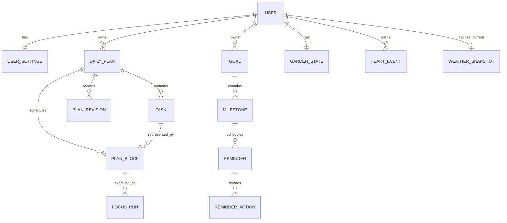

# Data and API Design

## Conventions

- Backend-generated UUIDs identify persistent records; timestamps are ISO 8601 with offsets and are stored as UTC instants.
- Each user, DailyPlan, and Reminder retains its IANA timezone/local date context. Intervals are start-inclusive/end-exclusive; scheduling precision is whole minutes.
- JWT is required for user-owned endpoints. Server-side ownership and validation apply before every persistence operation.
- State-changing AI data is strict structured output and passes the same validation as form data.

Canonical persisted names: DailyPlan, PlanBlock, FocusRun, PlanRevision, Goal, Milestone, Reminder, ReminderAction, HeartEvent, GardenState, PlantType, WeatherSnapshot.

`PlanningSession` and `PlanningMessage` are runtime/domain concepts for full-application planning chat. They are not durable chat history. Raw conversational planning text is not persisted in PostgreSQL by default. Structured Task Draft, intent, and other state required for product behavior may be persisted as DailyPlan, Task, and related records.

## Domain relationships

`Task` describes work, `PlanBlock` schedules a portion of it, `FocusRun` records actual execution, and `PlanRevision` records a meaningful recovery. Planned and actual duration are never one field. One GardenState exists per user. PlantType is a settings/visual field on that shared progression, not a second garden. At most one WeatherSnapshot exists per user and is replaced on refresh; it is not weather or location history.

## Key persisted fields and enums

| Entity | Required responsibility / key fields |
|---|---|
| `User`, `UserSettings` | Identity, password hash, timezone, focus/break defaults, quiet hours, launch-on-startup, widget visibility, always-on-top, Mr. Bloom display name, active PlantType, weather-aware visuals on/off, city or optional coarse location. |
| `Task`, `DailyPlan` | Task estimate, priority, optional latest-finish deadline, core-or-optional and fixed-or-flexible classifications, fixed start for fixed Tasks, dependencies; plan date, windows, settings snapshot, and feasibility. |
| `PlanBlock`, `PlanRevision`, `FocusRun` | Block type `FOCUS`/`BREAK`/`FIXED_EVENT`; locked flag for fixed-Task Focus blocks; protected revision history; FocusRun timestamps, pauses, planned reference, actual elapsed time, and `DONE`/`FINISHED_EARLY`/`NEED_MORE_TIME`/`SKIP`. |
| `Goal`, `Milestone` | Goal outcome/target/progress; milestone expected outcome, deadline, order, status, and reminder setting. |
| `Reminder`, `ReminderAction` | User-local trigger instant, due/unread/read/acted state, idempotency key, and canonical action. Milestone ReminderAction values: `CREATE_PLAN`, `MARK_COMPLETED`, `MOVE_MILESTONE`, `REMIND_LATER`. Focus/task widget actions may include `START_FOCUS`, `REMIND_LATER`, and `OPEN_BLOOMING`; `START_FOCUS` and `OPEN_BLOOMING` are not Milestone ReminderAction values. |
| `HeartEvent`, `GardenState` | Idempotent Heart Progress ledger; one GardenState with stage `DORMANT`, `SPROUTING`, `GROWING`, `BLOOMING`, or `FLOURISHING`. |
| `PlantType` | Visual selection `POTHOS`, `CACTUS`, `BONSAI`, `SUNFLOWER`, or `LOTUS`. Switching it must not mutate Heart Progress or GardenState stage. |
| `WeatherSnapshot` | At most one current cached WeatherContext (`CLEAR`, `CLOUDY`, `RAINY`, `STORMY`, `FOGGY`, `SNOWY`, `UNKNOWN`), freshness, and coarse location key. A refresh replaces this cache. Not a weather or GPS history trail. |

`WidgetState` (`DEFAULT`, `REMINDER`, `FOCUSING`, `SESSION_RESULT`, `HIDDEN`) is desktop runtime functional state. `WidgetContext` contains time-of-day (`MORNING`, `AFTERNOON`, `EVENING`, `NIGHT`) and optional WeatherContext. It remains independent from `WidgetState`. Time-of-day is resolved by Tauri from the configured timezone and is not a persisted planning input.

## Endpoint index

| Method | Path | Responsibility |
|---|---|---|
| POST | `/api/v1/auth/register`, `/login`, `/logout` | Account lifecycle and JWT issuance/invalidation. |
| GET/PATCH | `/api/v1/me`, `/settings` | Profile, timezone, defaults, widget preferences, PlantType, and weather-location preferences. |
| POST | `/api/v1/plans/preview` | Non-persistent deterministic Reality Check and PlanBlock preview. |
| POST/GET/PATCH | `/api/v1/plans`, `/plans/{id}`, `/plans/{id}/blocks/{blockId}` | Persisted DailyPlans and scheduler-validated edits. |
| POST | `/api/v1/plans/{id}/replan` | Atomic protected-history recovery. |
| POST/PATCH | `/api/v1/focus-runs`, `/focus-runs/{id}` | Start/pause/resume/outcome; stores `started_at` and `expected_end_at`; retains actual execution. |
| POST | `/api/v1/planning-sessions/messages` | Interpret full-application planning chat into a structured Task Draft or intent. Does not persist raw conversational text by default and does not store chat history or semantic memory. |
| CRUD | `/api/v1/goals`, `/goals/{id}/milestones` | Goals, roadmaps, milestones, and downstream-date option. |
| GET | `/api/v1/reminders/upcoming` | Reminder definitions and due times for Tauri synchronization. |
| POST | `/api/v1/reminders/{id}/actions` | Persist ReminderAction after local due-time presentation. |
| GET | `/api/v1/garden` | Current GardenState, Heart Progress summary, and active PlantType. |
| PATCH | `/api/v1/garden/plant-type` | Change PlantType without resetting Heart Progress or GardenState. |
| GET | `/api/v1/weather` | Cached WeatherSnapshot / WeatherContext for presentation. |

Exact path names may be finalized at implementation provided the responsibilities above remain. Do not add email-notification, rest-period, or plant-decay endpoints.

## Planning preview contract

`POST /api/v1/plans/preview` accepts Tasks with `estimatedMinutes`, `priority`, optional `deadline`, `core` classification, `placementType` (`FIXED` or `FLEXIBLE`), `fixedStart` when fixed, splitting settings, and dependencies. Fixed events are separate non-Task inputs. Preferences include `focusDuration`, `minimumBlockDuration`, `breakDuration`, and buffer percentage; `minimumBlockDuration` must be between 1 and `focusDuration`, while a complete shorter Task remains schedulable as one shorter Focus block.

The response contains one ordered `planBlocks` array. It includes generated `FOCUS` and `BREAK` blocks and every unchanged input fixed event as a `FIXED_EVENT` block. Fixed-Task Focus blocks are marked locked. The frontend renders this array directly and must not reconstruct or merge fixed events separately.

Feasibility reports the full-request `expectedFocusBlockCount`, `requiredBreakCount = max(0, expectedFocusBlockCount - 1)`, required break minutes, buffer, and demand. Breaks attributable to unscheduled work remain in feasibility totals but are absent from `planBlocks`. Unscheduled reasons include `INSUFFICIENT_CAPACITY`, `NO_CONTIGUOUS_INTERVAL`, `DEPENDENCY_UNSCHEDULED`, `MINIMUM_BLOCK_NOT_MET`, `DEADLINE_EXCEEDED`, `FIXED_TASK_CONFLICT`, and `FIXED_TASK_OUTSIDE_WINDOW`.

## Sync, jobs, and transaction boundaries

- FastAPI stores Reminder definitions and state. Tauri synchronizes upcoming reminders at startup, after sleep, and after reminder changes, then evaluates due times locally. There is no per-second backend polling and no MVP email/OS-toast job.
- HeartEvent writes are deterministic, auditable, and transactional. Opening the application creates no HeartEvent. Switching PlantType is a settings/visual write only.
- WeatherSnapshot is the current replaceable cache for one user, refreshed coarsely (startup, wake, location change, low-frequency interval). Fetch failure may store or return `UNKNOWN`. Disabling weather-aware visuals omits the overlay and does not require storing `UNKNOWN`. Historical weather is not persisted.
- Re-planning updates the PlanRevision and only eligible future flexible Task PlanBlocks in one transaction; completed FocusRuns, unchanged fixed events, locked fixed-Task PlanBlocks, and the protected active session are locked against accidental alteration.
- The frontend maps PlantType + GardenState stage to artwork and composes time/weather layers separately. It does not calculate Heart Progress, scheduling, or reminder due times as an authority.
