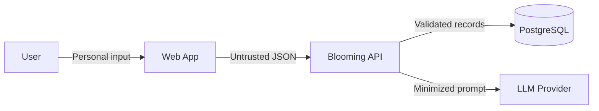

# Security and Privacy

## 1. Protected assets and data

| Asset/data | Classification | Impact if exposed or lost | Retention/deletion |
|---|---|---|---|
| Source code and public documentation | Public/Internal | Integrity or intellectual-property impact | Retained in version control |
| Task titles, descriptions, schedules, fixed events | Personal | Reveals routines, obligations, or locations | Retain while needed for product use; delete with owned plan/data request |
| Conversational planning text | Personal, potentially sensitive | May contain habits, locations, deadlines, or personal context | Do not persist by default in MVP; retain only structured result unless explicitly required |
| Focus execution history | Personal | Reveals behavior and productivity patterns | Retain with plan history; delete with owned data |
| Account identifiers and JWT session metadata | Personal | Enables correlation or unauthorized access | Retain only as required for account/session operation; protect and delete with account policy |
| API keys, database credentials, session secrets | Secret | Service compromise or cost abuse | Store only in secret/environment configuration; rotate on exposure |
| Application logs and metrics | Internal | May reveal operations if overly detailed | Minimize; use provider retention appropriate to low-volume MVP |

## 2. Trust boundaries and data flows

## 3. Authentication and authorization

- The MVP provides register, login, logout, and JWT-based authentication.
- Every user-owned plan, task, FocusRun, goal, reminder, notification, plant, and settings read/write must enforce ownership in the backend.
- Client-side route guards are usability controls, not authorization.
- Account deletion must remove owned primary data and document backup-retention implications.

## 4. Threats and controls

| Threat | Target | Likelihood/impact | Control | Verification |
|---|---|---|---|---|
| Malformed or oversized request | API/domain availability | Medium/Medium | Bean/server validation, list limits, duration ranges, body-size limit | Negative API tests |
| Injection through text fields | Database, logs, AI prompt | Medium/High | Parameterized persistence, output encoding, structured prompt fields, log exclusion | Security tests and review |
| Secret committed to repository | External services and database | Medium/High | `.env` ignored, `.env.example` placeholders, secret scan | CI scan and repository review |
| Personal content in logs | User privacy | Medium/High | Log IDs/codes/timings only; redact bodies and prompts | Log assertion/manual inspection |
| Invalid or adversarial LLM output | Scheduler and user trust | High/High | Treat output as untrusted, validate schema/ranges/references, manual review | AI evaluation and negative cases |
| Unauthorized object access after auth | Personal plans | Medium/Critical | Server-side ownership predicates on every operation | Integration tests with two users before multi-user release |
| API/LLM cost abuse | Availability and budget | Medium/Medium | Request limits, quotas, timeouts, maximum clarifications | Usage-monitoring test |
| Cross-site scripting from user content | Browser session | Medium/High | Framework escaping, avoid unsafe HTML, security headers | UI security test and header review |

## 5. LLM privacy boundary

- Data sent: current natural-language planning input and only the current draft fields needed for interpretation/clarification.
- Data not sent: credentials, database IDs, hidden logs, unrelated plan history, focus analytics, reward history, or other users' data.
- Disclosure: the conversational interface states that text is processed by an external AI provider; manual planning remains available.
- Retention/configuration: choose the least-retentive provider configuration available within project constraints and document the selected policy before conversational integration is released.
- Output handling: parse into a strict schema, validate all fields and references, show the draft for user review, and reject unsafe/invalid output.
- Failure: timeout or provider error returns a recoverable state and manual form; it never creates a fabricated plan.

## 6. Secrets, logs, and dependencies

- Secrets live in local environment files excluded from Git and in the production platform's secret store.
- `.env.example` contains safe placeholders only.
- Rotate a secret immediately if it appears in source, logs, screenshots, or conversation history.
- Logs may include timestamp, route, status, duration, stable error code, and correlation ID; they exclude request/response bodies containing personal data.
- Dependency updates and automated vulnerability checks run before release; critical exploitable findings block deployment.

## 7. Privacy controls

- Collect only data needed for implemented features.
- Do not persist raw conversational text in the MVP by default.
- Let the authenticated user delete owned product data and associated execution/history records according to the published retention policy.
- Backup deletion is not assumed immediate; its retention and restore behavior must be stated after selecting a provider.
- Analytics, if later added, must avoid task text and use documented event names.

## 8. Release gates

- [ ] Server-side validation covers external input.
- [ ] Secrets and real environment files are absent from the repository.
- [ ] Personal content and full prompts are absent from logs.
- [ ] AI transfer is minimized, disclosed, and has manual fallback.
- [ ] Production traffic uses encrypted transport.
- [ ] Multi-user persistence is disabled until identity and ownership tests pass.
- [ ] Data deletion and provider retention behavior are documented before public data collection.
