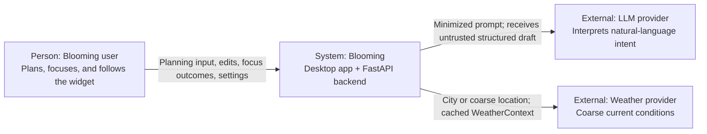

# Software Architecture: System Context

## 1. Technology summary

| Area | Technology | Purpose |
|---|---|---|
| Desktop shell | Tauri 2 / Rust | Main window, widget window, tray, local timer, local reminder due-time evaluation, local time-of-day |
| Desktop UI | Svelte + TypeScript + Vite | Today, Goals, Settings, and widget presentation layers |
| Backend API | Python + FastAPI + Pydantic | Validation, deterministic domain logic, persistence, reminder records, Heart Progress, weather cache |
| Database | PostgreSQL with SQLAlchemy | Durable user, plan, execution, Goal/Reminder, GardenState, PlantType, and WeatherSnapshot |
| External AI service | Provider-agnostic LLM API | Natural-language interpretation into structured planning data |
| Weather provider | Remote weather API | Coarse current conditions mapped to WeatherContext |
| Local environment | Docker Compose for the backend | Reproducible API and database startup |

Exact framework patch versions and the production LLM/weather/hosting providers will be selected during initialization and deployment.

## 2. C4 Level 1 — System Context

Google Calendar is intentionally absent. Email, push, and OS toast/banner notifications are outside the MVP. Reminders are stored by FastAPI and presented by Tauri (tray red-dot) and the Svelte widget bubble.

## 3. Representative interaction

For structured Daily Planning, the user submits tasks, time constraints, and preferences from the desktop UI. FastAPI validates the input, calculates feasibility, and schedules sessions without an external dependency.

For conversational planning, FastAPI sends only the minimum text/context needed for interpretation to the configured LLM provider. The returned draft is validated and presented for review in the full application. The deterministic scheduler remains the source of truth for feasibility and timeline placement.

For weather, FastAPI fetches and caches at most one current WeatherSnapshot per user, maps it to WeatherContext, and Tauri/Svelte apply ambient layers. Unavailable or invalid weather may yield `UNKNOWN` and time-only presentation. Disabled weather-aware visuals omit the overlay without requiring `UNKNOWN`.

## 4. People and external systems

| Element | Type | Responsibility | Relationship/data |
|---|---|---|---|
| Blooming user | Person | Defines intent, reviews plans, executes sessions, and owns decisions | Sends personal planning data; receives timelines, widget presentation, and explanations |
| LLM provider | External system | Extracts task/time meaning and clarification needs | Receives minimized prompt; returns untrusted structured data |
| Weather provider | External system | Supplies current conditions for presentation | Receives city/coarse location; must not receive a GPS history trail |
| Hosting platform | Infrastructure, provider undecided | Runs deployed API/database | Receives application artifacts, configuration, and operational metadata |

## 5. Trust boundaries and assumptions

- Desktop input, AI output, weather-provider payloads, and externally supplied timestamps are untrusted until backend validation.
- The LLM provider must not receive credentials, database identifiers, unrelated plan history, or hidden application state.
- JWT authentication and server-side ownership checks protect all user-owned state.
- The scheduler must run without the LLM provider and without the weather provider.
- WeatherContext must not enter scheduling, reminder timing, or Heart Progress calculation.
- Production provider details must be reflected here once selected.

## 6. Consistency check

- [x] Only current or explicitly planned MVP dependencies are shown.
- [x] The LLM relationship is interpretation, not scheduling authority.
- [x] Tray red-dot and widget bubbles are included; OS notifications, email, and calendar integration are excluded.
- [ ] Replace provider-neutral deployment descriptions when production providers are selected.
