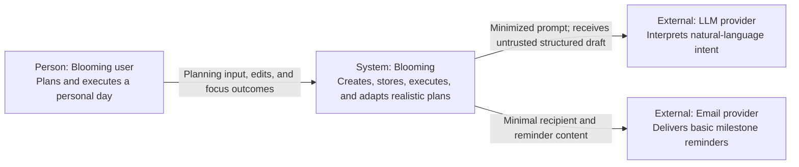

# Software Architecture: System Context

## 1. Technology summary

| Area | Technology | Purpose |
|---|---|---|
| Frontend | Next.js, React, and TypeScript | Home/Mr. Bloom, Today, Goals, focus, settings, and integrated plant experience |
| Backend | FastAPI and Python | API, validation, deterministic domain logic, and application orchestration |
| Database | PostgreSQL with SQLAlchemy and Alembic | Durable user, plan, execution, goal/reminder, and plant state |
| External AI service | Provider-agnostic LLM API | Natural-language interpretation into structured planning data |
| Local environment | Docker Compose | Reproducible service startup |

Exact framework patch versions and the production LLM/hosting providers will be selected during initialization and deployment.

## 2. C4 Level 1 — System Context

Google Calendar is intentionally absent. A basic email provider is an MVP dependency for milestone reminders; in-app notifications are persisted by Blooming.

## 3. Representative interaction

For structured Quick Plan, the user submits tasks, time constraints, and preferences directly to Blooming. Blooming validates the input, calculates feasibility, and schedules sessions without an external dependency.

For conversational planning, Blooming sends only the minimum text/context needed for interpretation to the configured LLM provider. The returned draft is validated and presented for review. The deterministic Blooming scheduler remains the source of truth for feasibility and timeline placement.

## 4. People and external systems

| Element | Type | Responsibility | Relationship/data |
|---|---|---|---|
| Blooming user | Person | Defines intent, reviews plans, executes sessions, and owns decisions | Sends personal planning data; receives timelines and explanations |
| LLM provider | External system | Extracts task/time meaning and clarification needs | Receives minimized prompt; returns untrusted structured data |
| Email provider | External system | Delivers basic milestone reminder email | Receives minimal recipient and rendered reminder content |
| Hosting platform | Infrastructure, provider undecided | Runs deployed frontend/API/database | Receives application artifacts, configuration, and operational metadata |

## 5. Trust boundaries and assumptions

- Browser input, AI output, and externally supplied timestamps are untrusted until backend validation.
- The LLM provider must not receive credentials, database identifiers, unrelated plan history, or hidden application state.
- JWT authentication and server-side ownership checks protect all user-owned state.
- The scheduler must run without the LLM provider.
- Production provider details must be reflected here once selected.

## 6. Consistency check

- [x] Only current or explicitly planned MVP dependencies are shown.
- [x] The LLM relationship is interpretation, not scheduling authority.
- [x] In-app notifications and basic milestone email are included; calendar integration and complex web-push/advanced notification integrations are excluded.
- [ ] Replace provider-neutral deployment descriptions when production providers are selected.
