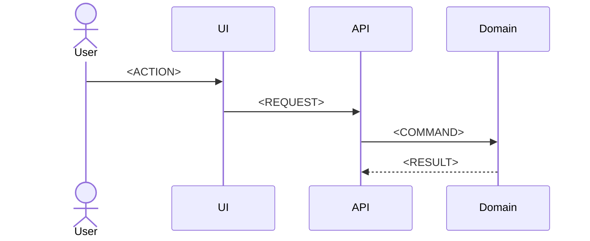

# Technical Plan: SPEC-NNN <FEATURE_NAME>

## Implementation approach

<!-- Explain how the feature will satisfy the specification. -->

## Runtime flow

## Code changes

| Module/file | Change | New/modified | Test approach |
|---|---|---|---|
| `<PATH_OR_MODULE>` | `<CHANGE>` | New/Modified | `<TEST>` |

## Data and API changes

<!-- Include exact changes or link data-api-design.md. -->

## Algorithm and rule enforcement

<!-- Add concise pseudocode for non-trivial logic. State determinism and complexity when relevant. -->

## Errors, security, and observability

- `<BEHAVIOR_OR_CONTROL>`

## Testing approach

| Level | Main coverage |
|---|---|
| Unit | `<DOMAIN_RULES_AND_BOUNDARIES>` |
| Integration/API | `<BOUNDARIES>` |
| UI/E2E | `<CRITICAL_FLOW>` |

## Migration, rollout, and rollback

`<STEPS_OR_NOT_APPLICABLE>`

## Technical decisions and risks

- `<DECISION_RISK_OR_ADR>`

