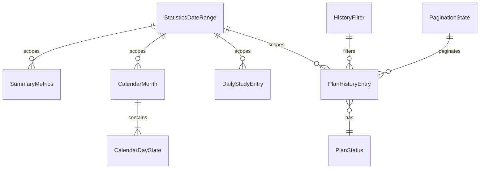
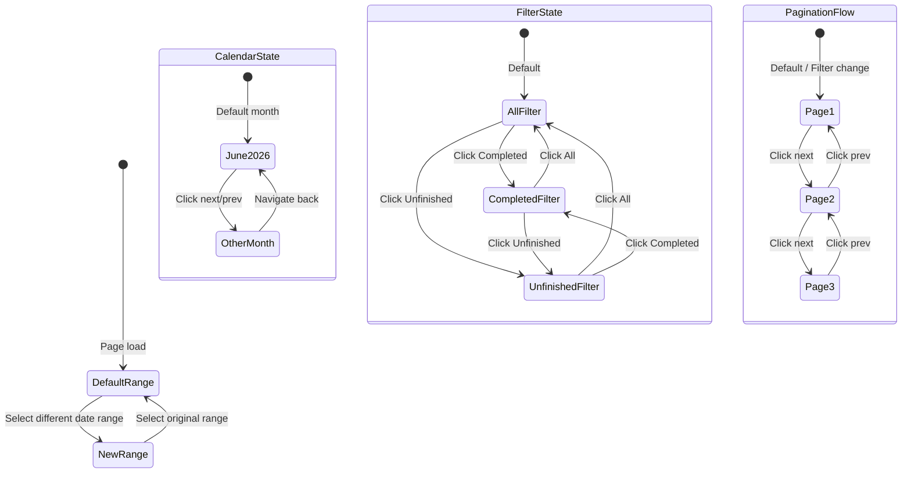

# Data Model: Statistics Screen

**Feature**: Statistics Screen | **Date**: 2026-09-15

## Entities

### StatisticsDateRange

Represents the selected reporting period for the Statistics page.

```typescript
// frontend/src/lib/features/statistics/types.ts

export interface StatisticsDateRange {
  /** Unique identifier for the range option */
  id: string;
  /** Start date of the range (inclusive) */
  startDate: Date;
  /** End date of the range (inclusive) */
  endDate: Date;
  /** Formatted display string (e.g., "Jun 1 - 14, 2026") */
  displayLabel: string;
}
```

**Validation rules**: `startDate <= endDate`. Both dates required.

---

### SummaryMetrics

Contains the aggregate KPI values for the active date range.

```typescript
export interface SummaryMetrics {
  /** Total study time — hours component */
  studyTimeHours: number;
  /** Total study time — minutes component */
  studyTimeMinutes: number;
  /** Number of days with study activity */
  studyDayCount: number;
  /** Number of completed plans */
  completedPlanCount: number;
  /** Number of unfinished plans */
  unfinishedPlanCount: number;
}
```

**Validation rules**: All values >= 0. `studyTimeMinutes` in range [0, 59].

---

### CalendarDayState

Represents a single calendar day and its study status.

```typescript
export type StudyStatus = 'studied' | 'no-record';

export interface CalendarDayState {
  /** Day of the month (1-31) */
  day: number;
  /** Whether the user studied on this day */
  status: StudyStatus;
}
```

**Validation rules**: `day` must be valid for the given month (1–28/29/30/31).

---

### CalendarMonth

Contains all data needed to render a single month in the study calendar.

```typescript
export interface CalendarMonth {
  /** Full year (e.g., 2026) */
  year: number;
  /** Zero-indexed month (0=January, 11=December) — matches JS Date convention */
  month: number;
  /** Days with study records for this month */
  studiedDays: CalendarDayState[];
}
```

**Derived properties** (computed at render time, not stored):
- `daysInMonth`: `new Date(year, month + 1, 0).getDate()`
- `firstWeekdayOffset`: `(new Date(year, month, 1).getDay() + 6) % 7` (Monday = 0)
- `monthLabel`: formatted via `Intl.DateTimeFormat` or manual mapping

---

### DailyStudyEntry

Represents a single day's study duration for the bar chart.

```typescript
export interface DailyStudyEntry {
  /** Day-of-week label (e.g., "Mon", "Tue") */
  dayLabel: string;
  /** Study hours for this day (can be fractional, e.g., 2.5) */
  hours: number;
}
```

**Validation rules**: `hours >= 0`. `dayLabel` must be a valid weekday abbreviation.

---

### PlanHistoryEntry

Represents a single row in the plan history table.

```typescript
export type PlanStatus = 'Completed' | 'Unfinished';

export interface PlanHistoryEntry {
  /** Unique identifier for the plan */
  id: string;
  /** Date of the plan (display string, e.g., "Jun 14") */
  dateLabel: string;
  /** Name/title of the plan */
  planName: string;
  /** Number of tasks completed */
  completedTasks: number;
  /** Total number of tasks in the plan */
  totalTasks: number;
  /** Completion status */
  status: PlanStatus;
}
```

**Validation rules**: `completedTasks <= totalTasks`. Both >= 0. `status` must be `'Completed'` if `completedTasks === totalTasks`.

---

### HistoryFilter

Enumeration controlling which plan history rows are visible.

```typescript
export type HistoryFilter = 'All' | 'Completed' | 'Unfinished';
```

---

### PaginationState

Tracks the current pagination position.

```typescript
export interface PaginationState {
  /** Current page number (1-indexed) */
  currentPage: number;
  /** Total number of pages */
  totalPages: number;
  /** Number of items displayed per page */
  itemsPerPage: number;
  /** Total number of items across all pages */
  totalItems: number;
}
```

**Validation rules**: `currentPage >= 1 && currentPage <= totalPages`. `totalPages = Math.ceil(totalItems / itemsPerPage)`. `itemsPerPage > 0`.

**Derived properties**:
- `showingCount`: `Math.min(itemsPerPage, totalItems - (currentPage - 1) * itemsPerPage)`
- `isFirstPage`: `currentPage === 1`
- `isLastPage`: `currentPage === totalPages`

## Entity Relationships



**Data flow**: `StatisticsDateRange` is the top-level selector. Changing it determines which `SummaryMetrics`, `CalendarMonth` data, `DailyStudyEntry` array, and `PlanHistoryEntry` array are displayed. All data is read from typed mock constants — no state transitions or mutations beyond filter/pagination UI state.

## State Transitions

The Statistics page has minimal state transitions since it is primarily read-only:



**Important**: Filter change always resets pagination to page 1.
