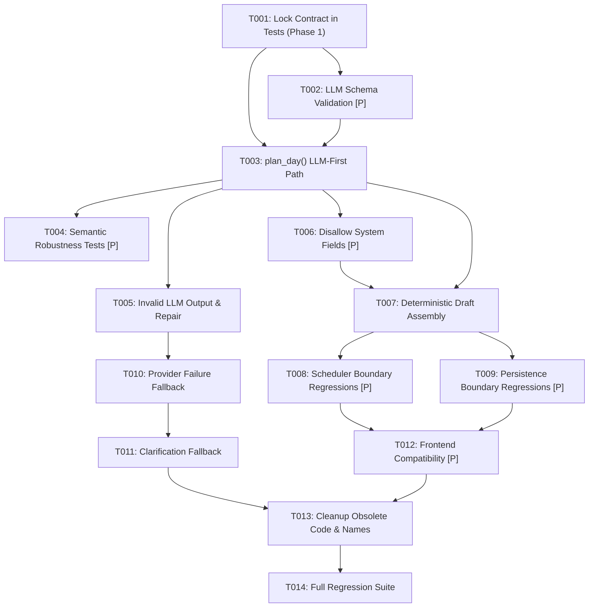

# Tasks: Refactor Today Planning to LLM-First

**Feature**: `027-refactor-today-planning`  
**Input**: Design documents from `specs/027-refactor-today-planning/` (`spec.md`, `plan.md`)  
**Prerequisites**: `spec.md`, `plan.md`, `constitution.md`  
**Organization**: Tasks are grouped by User Story and Phase in strict dependency order, mapped across the 13 required task groups.  

## Format: `- [ ] [TaskID] [P?] [Story?] Description with file path`

- **[P]**: Parallelizable task (different files or independent verification scopes)
- **[Story]**: Associated user story (`[US1]`, `[US2]`, `[US3]`)

---

## Phase 1: Foundational — Lock the Contract (Task Group 1)

**Purpose**: Establish failing tests and freeze the LLM-first contract across unit and integration test suites before refactoring implementation code.

- [x] T001 [US1] Lock PLAN_DAY LLM-first contract in backend/tests/unit/test_block10_parser.py, backend/tests/api/test_block_9_integration.py, and backend/tests/api/test_block_8_daily_plan.py
  - **Objective**: Update test expectations so standard Today planning asserts `tier == "LLM"`, verifies planner LLM structured extraction is invoked, successful extraction creates a canonical `TodayDraft`, `preview` is `null`, and no planning-domain persistence occurs. Identify and remove/update architecture-specific assertions such as `llm.assert_not_called()`, `tier == "PARSER"`, and assumptions that high-confidence parser skips the LLM. Preserve behavioral test coverage.
  - **Exact files likely involved**:
    - `backend/tests/unit/test_block10_parser.py`
    - `backend/tests/api/test_block_9_integration.py`
    - `backend/tests/api/test_block_8_daily_plan.py`
  - **Tests to write/update first**:
    - Update `backend/tests/unit/test_block10_parser.py` tests that asserted parser skips LLM.
    - Update `backend/tests/api/test_block_8_daily_plan.py::test_integration_zero_llm_calls_for_supported_input` to assert `mock_llm.assert_awaited_once()` and `response.tier == "LLM"`.
    - Update `backend/tests/api/test_block_9_integration.py` to ensure mock LLM payloads align with new extraction requirements and test assertions.
  - **Implementation work**:
    - Adjust test assertions to expect LLM structured extraction on the normal Today planning path.
    - Remove brittle checks requiring parser execution without LLM invocation.
  - **Completion criteria**: Tests fail against legacy parser-first behavior and pass only when LLM structured extraction is invoked, returning `tier="LLM"` and `preview=None`.

---

## Phase 2: User Story 1 — Natural Language Planning (Priority: P1) 🎯 MVP

**Goal**: Enable users to express tasks and availability in flexible natural language, using LLM structured extraction as the primary path to produce a canonical `TodayDraft`.

**Independent Test**: Submit varied natural language planning requests with mock LLM extraction; verify canonical `TodayDraft` contains semantic tasks, availability windows, `tier="LLM"`, and `preview=None` without database writes.

### Task Group 2: LLM Structured Extraction Contract

- [x] T002 [P] [US1] Verify and refine LLM structured schema in backend/app/ai/handlers/planner.py and backend/tests/unit/test_block10_parser.py
  - **Objective**: Verify or refine the Pydantic schema (`LLMDayPlan`, `LLMTask`) to support valid tasks, availability windows, Core/Optional importance, fixed start, deadline, duration bounds (5 to 480 min), and priority enums. Ensure malformed outputs or invalid enums trigger `ValidationError`.
  - **Exact files likely involved**:
    - `backend/app/ai/handlers/planner.py`
    - `backend/tests/unit/test_block10_parser.py`
  - **Tests to write/update first**:
    - Unit tests in `backend/tests/unit/test_block10_parser.py` validating `LLMDayPlan.model_validate()` against:
      - Valid tasks with combinations of fixed start (`14:00`), deadline (`17:00`), Core/Optional importance.
      - Availability windows formatted as `list[tuple[str, str]]`.
      - Invalid enums (e.g. `importance="CRITICAL"`, `priority="MAX"`).
      - Duration boundary violations (`duration_min=4`, `duration_min=481`).
      - Missing tasks list or empty tasks.
  - **Implementation work**:
    - Refine `LLMTask` and `LLMDayPlan` schemas in `backend/app/ai/handlers/planner.py`.
    - Validate field regex patterns (`fixed_start`, `deadline`) and constraints (`duration_min` ge=5, le=480).
  - **Completion criteria**: Schema unit tests pass; `LLMDayPlan` strictly enforces types and rejects invalid enums/durations.

### Task Group 3: Make PLAN_DAY LLM-First

- [x] T003 [US1] Refactor planner.plan_day() to execute LLM extraction as primary path in backend/app/ai/handlers/planner.py
  - **Objective**: Refactor `planner.plan_day()` so that the planner LLM is the primary extraction path on normal inputs. Successful structured extraction proceeds directly into deterministic normalization without relying on parser-first matching. Ensure scheduler is NOT called here.
  - **Exact files likely involved**:
    - `backend/app/ai/handlers/planner.py`
  - **Tests to write/update first**:
    - Unit and integration tests in `backend/tests/unit/test_block10_parser.py` and `backend/tests/api/test_block_9_integration.py` asserting normal messages trigger `_llm_plan()` as the first step, without calling `parse()` as a gatekeeper.
  - **Implementation work**:
    - In `plan_day()`, resolve budget mode and available routes, and invoke `_llm_plan()` as the primary execution path.
    - Forward valid extraction into deterministic `_parsed_from_llm()` normalization.
    - Set `preview = None` in the returned `ChatResponse`.
    - Preserve carried tasks evaluation when input is a pure date command without tasks.
  - **Completion criteria**: Normal Today planning messages always invoke LLM extraction first when routes are available; returns `ChatResponse` with `tier="LLM"`, `preview=None`, and `draft` populated with extracted tasks.

### Task Group 5: Natural-Language Robustness Tests

- [x] T004 [P] [US1] Add natural-language semantic robustness tests in backend/tests/unit/test_block10_parser.py and backend/tests/api/test_block_9_integration.py
  - **Objective**: Add tests using multiple semantically equivalent natural-language inputs to verify robust semantic extraction without adding parser regex rules for these phrases. Cover variations of availability, optional tasks, duration-before-task wording, and conversational planning phrasing.
  - **Exact files likely involved**:
    - `backend/tests/unit/test_block10_parser.py`
    - `backend/tests/api/test_block_9_integration.py`
  - **Tests to write/update first**:
    - Test variations for availability: "I can work between 1 PM and 5 PM", "free from 13:00 to 17:00", "only have 4 hours this afternoon".
    - Test variations for optional tasks: "maybe read docs for 20 mins", "read docs if there is time", "optional kanji practice 30m".
    - Test variations for duration-before-task: "45 minutes of writing", "take an hour to debug".
    - Test conversational phrasing: "Hey Mr. Bloom, let's get kanji practice done for 30m and write tests for 45m".
  - **Implementation work**:
    - Setup mock LLM structured extraction responses capturing equivalent semantic tasks and windows for each variation.
    - Verify final canonical `TodayDraft` yields equivalent normalized tasks, durations, and importance flags across all variations.
    - Verify that no new regex was added to `backend/app/ai/parser.py`.
  - **Completion criteria**: All semantic variations produce expected canonical `TodayDraft` models without parser regex patches.

### Task Group 6: Invalid LLM Output and Repair

- [x] T005 [US1] Test and implement invalid LLM output handling and single repair round in backend/app/ai/handlers/planner.py and backend/tests/unit/test_block10_parser.py
  - **Objective**: Test and implement handling for malformed JSON, schema validation failures, invalid task fields, and failed repair attempts. Ensure a single targeted repair round is executed when schema validation fails, and if repair fails, prevent any invalid draft from reaching the frontend while preserving assistant reply text where contract requires.
  - **Exact files likely involved**:
    - `backend/app/ai/handlers/planner.py`
    - `backend/tests/unit/test_block10_parser.py`
  - **Tests to write/update first**:
    - Unit tests in `test_block10_parser.py`:
      - LLM returns malformed JSON string -> triggers repair call -> succeeds if repair returns valid JSON.
      - LLM returns schema validation error (e.g. invalid duration) -> repair call executed -> succeeds if corrected.
      - Failed repair (repair returns error or invalid schema) -> fails gracefully to fallback or clarification.
      - Preserves assistant reply when present in raw output.
  - **Implementation work**:
    - Refine repair logic in `_llm_plan()`: on `ValidationError`, send a single repair prompt with validation error details and schema constraint.
    - If repair succeeds, return normalized plan; if repair fails (or in non-NORMAL budget modes), safely return empty plan or fallback candidate.
    - Ensure unparseable/invalid draft objects never reach `ChatResponse.draft`.
  - **Completion criteria**: Malformed output triggers at most one repair round; failing repair never crashes or emits invalid drafts; preserved assistant reply is retained.

---

## Phase 3: User Story 3 — Preserved Application Authority (Priority: P1)

**Goal**: Guarantee that the application code maintains authoritative ownership of task IDs, plan dates, timezones, duration calculations, validation bounds, scheduler execution, and database persistence.

**Independent Test**: Pass adversarial LLM outputs containing synthetic IDs, unauthorized plan dates, or timeline blocks; assert application overwrites IDs, enforces context dates, sets `preview=null`, and makes zero database writes before explicit save.

### Task Group 2 (Cont.): Disallow Application-Owned Fields from LLM

- [x] T006 [P] [US3] Ensure application-owned fields are rejected or ignored from LLM output in backend/app/ai/handlers/planner.py and backend/tests/unit/test_block10_parser.py
  - **Objective**: Verify that application-owned fields (task IDs, database IDs, plan dates, timezones, reality check tokens, or scheduled timeline blocks) cannot be accepted or injected from LLM raw JSON output into domain state.
  - **Exact files likely involved**:
    - `backend/app/ai/handlers/planner.py`
    - `backend/tests/unit/test_block10_parser.py`
  - **Tests to write/update first**:
    - Unit test passing injected properties (`id="custom-uuid"`, `plan_date="2099-01-01"`, `timeline=[...]`, `token="fake"`) to `LLMDayPlan` and `_parsed_from_llm()`.
    - Assert injected properties are ignored/discarded and do not leak into `ParsedPlan` or `TodayDraft`.
  - **Implementation work**:
    - Configure `extra = "ignore"` on `LLMTask` and `LLMDayPlan`.
    - Ensure `_parsed_from_llm()` only extracts whitelisted semantic fields (`title`, `duration_min`, `importance`, `priority`, `category`, `fixed_start`, `deadline`, `windows`, `assumptions`).
  - **Completion criteria**: Adversarial or hallucinated system fields in LLM payloads are discarded; application retains exclusive control of domain attributes.

### Task Group 4: Preserve Deterministic TodayDraft Assembly

- [x] T007 [US3] Verify and preserve deterministic TodayDraft assembly and validation in backend/app/ai/handlers/planner.py and backend/tests/unit/test_draft_assembly.py
  - **Objective**: Verify that `d1`, `d2`, ... IDs remain deterministic; trusted plan date and timezone remain application-owned; totals, defaults, and provenance remain canonical; and `check_today()` still validates the final draft. Add regression tests where useful.
  - **Exact files likely involved**:
    - `backend/app/ai/handlers/planner.py`
    - `backend/app/ai/drafts.py`
    - `backend/tests/unit/test_draft_assembly.py`
    - `backend/tests/unit/test_block10_parser.py`
  - **Tests to write/update first**:
    - Regression tests in `test_draft_assembly.py` verifying that drafts assembled from LLM `ParsedPlan` receive sequential `d1`, `d2`, ... IDs.
    - Test asserting plan date matches `ctx.now.date()` or `ctx.default_date_offset`, regardless of LLM message content.
    - Test asserting `check_today(draft)` is invoked in `_preview()`, rejecting drafts that exceed time limits or have invalid intervals.
  - **Implementation work**:
    - Ensure `assemble_today(plan, ctx, carried)` in `drafts.py` continues to deterministically assign IDs, compute durations, and assign user/AI provenance.
    - Ensure `_preview()` in `planner.py` always runs `check_today(draft)` before creating `ChatResponse`.
  - **Completion criteria**: All draft task IDs follow canonical `d1`, `d2`, ... format; plan date and timezone match context; `check_today()` acts as the final gatekeeper.

### Task Group 9: Scheduler Boundary Regression

- [x] T008 [P] [US3] Verify scheduler boundary and preview=null invariant in backend/tests/api/test_today_preview.py and backend/tests/unit/test_scheduler_preview.py
  - **Objective**: Ensure initial Today creation returns `preview = null`; the scheduler is not called during initial extraction; "Generate Timeline" still calls `/today/preview`; and deterministic scheduler behavior is unchanged. Run existing scheduler tests.
  - **Exact files likely involved**:
    - `backend/app/ai/handlers/planner.py`
    - `backend/tests/api/test_today_preview.py`
    - `backend/tests/unit/test_scheduler_preview.py`
    - `backend/tests/unit/test_scheduler.py`
  - **Tests to write/update first**:
    - Assert `response.preview is None` across all `plan_day()` integration tests.
    - Test that `app.scheduler.engine` / `preview_draft` is never called during `plan_day()`.
    - Run existing scheduler test suite (`test_today_preview.py`, `test_scheduler_preview.py`, `test_scheduler.py`).
  - **Implementation work**:
    - Verify `_preview()` in `planner.py` explicitly sets `preview=None`.
    - Verify `/today/preview` route continues to successfully accept drafts generated by the LLM-first planner and schedule them deterministically.
  - **Completion criteria**: All existing scheduler tests pass; draft responses have `preview: null`; scheduler is only invoked via explicit `/today/preview` endpoint.

### Task Group 10: Persistence Boundary Regression

- [x] T009 [P] [US3] Verify persistence boundary and zero-write invariant before explicit Save in backend/tests/api/test_assistant_chat_contract.py and backend/tests/api/test_deferred_save.py
  - **Objective**: Ensure chat and assistant session records may persist, but `DailyPlan`, `Task`, and `PlanBlock` are NEVER persisted during draft creation. Ensure explicit Save behavior and idempotency/replacement behavior remain unchanged. Run existing Today Save tests.
  - **Exact files likely involved**:
    - `backend/app/ai/handlers/planner.py`
    - `backend/tests/api/test_assistant_chat_contract.py`
    - `backend/tests/api/test_block_9_integration.py`
    - `backend/tests/api/test_deferred_save.py`
  - **Tests to write/update first**:
    - In `test_block_9_integration.py` and `test_assistant_chat_contract.py`, assert `mock_session.add.assert_not_called()` for planning models during draft creation.
    - Run `test_deferred_save.py` to verify explicit save workflow remains intact.
  - **Implementation work**:
    - Ensure `plan_day()` performs read-only database operations (committing before provider calls to release locks) and never inserts domain entities.
    - Validate that existing save routes (`/today/save`) accept the LLM-generated draft and persist entities correctly.
  - **Completion criteria**: Zero planning-domain persistence occurs during draft creation; existing save and idempotency tests pass without modification.

---

## Phase 4: User Story 2 — Fallback to Deterministic Parser (Priority: P2)

**Goal**: Provide resilient degraded fallback to the deterministic parser when the LLM provider fails, times out, or budget mode is restricted, and ask targeted clarification when neither path succeeds.

**Independent Test**: Mock LLM provider timeout/failure; verify system catches exception, runs deterministic parser, and returns a usable draft with `tier="PARSER"` and `degraded="LLM_FAILED"`. For ambiguous input, verify single clarification question.

### Task Group 7: Provider Failure and Degraded Parser Fallback

- [x] T010 [US2] Move deterministic parser to fallback-only behavior on provider failure in backend/app/ai/handlers/planner.py and backend/tests/unit/test_block10_parser.py
  - **Objective**: Move the deterministic parser to fallback-only behavior. Test provider timeout, unavailable, and rate limit scenarios. Verify fallback parser succeeds when input contains recognizable task patterns, and define correct `tier` (`PARSER`), `degraded` (`LLM_FAILED` or `RULES_ONLY`), and reply behavior.
  - **Exact files likely involved**:
    - `backend/app/ai/handlers/planner.py`
    - `backend/tests/unit/test_block10_parser.py`
  - **Tests to write/update first**:
    - Unit tests in `test_block10_parser.py` simulating:
      - `LLMError("Provider timeout")` -> parser fallback succeeds -> returns `tier="PARSER"`, `degraded="LLM_FAILED"`.
      - `LLMError("Rate limit exceeded")` -> parser fallback succeeds -> returns `tier="PARSER"`, `degraded="LLM_FAILED"`.
      - `BudgetMode.RULES_ONLY` -> skips LLM -> returns `tier="PARSER"`, `degraded="RULES_ONLY"`.
  - **Implementation work**:
    - In `plan_day()`, encapsulate `_llm_plan()` in error handling.
    - If `_llm_plan()` fails or returns empty tasks and provider failed, fall back to `parse(message, lenient=True)`.
    - If lenient parse yields tasks/windows/assumptions, return `_preview()` with `tier="PARSER"` and `degraded="LLM_FAILED"` (or `mode.value`).
  - **Completion criteria**: All provider failure scenarios produce functional drafts via fallback parser with `tier="PARSER"` and appropriate `degraded` status; exceptions do not crash the service.

### Task Group 8: Clarification Fallback

- [x] T011 [US2] Implement clarification fallback when neither LLM nor fallback parser produces a valid draft in backend/app/ai/handlers/planner.py and backend/tests/unit/test_block10_parser.py
  - **Objective**: When neither LLM extraction nor deterministic fallback can produce a valid TodayDraft, ask one necessary clarification question. Do not invent tasks, do not generate a fake 45-minute task solely to avoid clarification, and preserve pending intent/session behavior.
  - **Exact files likely involved**:
    - `backend/app/ai/handlers/planner.py`
    - `backend/tests/unit/test_block10_parser.py`
  - **Tests to write/update first**:
    - Unit tests in `test_block10_parser.py` with empty string, gibberish ("asdf qwerty"), or unresolvable planning requests where LLM fails and parser finds no tasks.
    - Assert `response.question` is populated with a localized clarification prompt.
    - Assert `response.draft` contains 0 tasks (or is null) — no invented 45-minute tasks.
    - Assert `response.intent == "PLAN_DAY"`.
  - **Implementation work**:
    - In `plan_day()`, when both LLM extraction and lenient parse yield no tasks, return a `ChatResponse` containing a helpful clarification question (e.g. "Which tasks would you like to plan today?" / "Bạn muốn làm những việc gì hôm nay?").
    - Prevent fallback logic from inserting arbitrary 45-minute default tasks when no task title was identified.
  - **Completion criteria**: Ambiguous or empty inputs cleanly return a clarification question without fake tasks; session intent remains `PLAN_DAY`.

---

## Phase 5: Polish, Compatibility & Full Regression (Cross-Cutting)

**Purpose**: Verify frontend compatibility, remove dead parser-first branches and misleading comments, and run the complete automated test suite.

### Task Group 11: Frontend/API Compatibility

- [x] T012 [P] Verify frontend and API compatibility for ChatResponse in frontend/src/lib/features/mr-bloom/stores/mrBloomStore.test.ts and backend/tests/api/test_assistant_chat_contract.py
  - **Objective**: Verify the existing frontend can consume the new response without redesign. Check `ChatResponse`, `tier`/`degraded` display, `TodayDraftPreview`, `activeDraft` update, session restore, "Generate Timeline", and Save. Only change frontend code if the backend contract actually requires it.
  - **Exact files likely involved**:
    - `backend/tests/api/test_assistant_chat_contract.py`
    - `frontend/src/lib/features/mr-bloom/stores/mrBloomStore.ts`
    - `frontend/src/lib/features/mr-bloom/stores/mrBloomStore.test.ts`
    - `frontend/src/lib/features/mr-bloom/components/organisms/MrBloomConversationPanel.test.ts`
  - **Tests to write/update first**:
    - Run contract compatibility test `backend/tests/api/test_assistant_chat_contract.py::test_ct_015_backend_frontend_type_compatibility`.
    - Run frontend Vitest suite: `mrBloomStore.test.ts` and `MrBloomConversationPanel.test.ts`.
  - **Implementation work**:
    - Verify that frontend stores handle `tier: "LLM"` and `tier: "PARSER"` uniformly.
    - Confirm "Generate Timeline" trigger functions as expected when `preview` is `null`.
    - Apply minimal frontend type/display updates only if an unexpected contract divergence is found.
  - **Completion criteria**: Contract compatibility fixture passes; frontend tests pass without requiring UI redesign.

### Task Group 12: Cleanup Obsolete Parser-First Assumptions

- [x] T013 Clean up obsolete parser-first branches and misleading comments in backend/app/ai/handlers/planner.py and backend/tests/api/test_block_8_daily_plan.py
  - **Objective**: Remove unreachable parser-first branches, misleading docstrings and comments claiming "parser-first", and update test names/descriptions whose only purpose was enforcing zero-LLM Today happy path. Do NOT remove the deterministic parser itself, as it remains the degraded fallback.
  - **Exact files likely involved**:
    - `backend/app/ai/handlers/planner.py`
    - `backend/app/ai/parser.py`
    - `backend/tests/api/test_block_8_daily_plan.py`
    - `backend/tests/unit/test_block10_parser.py`
  - **Tests to write/update first**:
    - Rename `backend/tests/api/test_block_8_daily_plan.py::test_integration_zero_llm_calls_for_supported_input` to `test_integration_llm_first_for_supported_input` to avoid misleading test logs.
  - **Implementation work**:
    - Update module docstring in `backend/app/ai/handlers/planner.py` from "Parser first day planning..." to "LLM-first day planning with deterministic normalization and degraded parser fallback".
    - Remove dead code or redundant pre-parse checks that bypass LLM extraction unnecessarily.
    - Ensure comments clearly explain the role of deterministic code as normalization and authority gate.
  - **Completion criteria**: Code and comments accurately reflect the LLM-first architecture; no misleading test names; deterministic parser preserved exclusively as degraded fallback.

### Task Group 13: Full Regression

- [x] T014 Execute full automated regression suite in backend/tests/
  - **Objective**: Run all parser unit tests, planner tests, router tests, assistant API contract tests, draft contract tests, scheduler preview tests, Today Save tests, and relevant frontend Mr. Bloom tests. Then perform manual verification using unseen phrasing.
  - **Exact files likely involved**:
    - `backend/tests/unit/test_block10_parser.py`
    - `backend/tests/unit/test_daily_plan_parser.py`
    - `backend/tests/unit/test_router_rules.py`
    - `backend/tests/unit/test_draft_assembly.py`
    - `backend/tests/unit/test_scheduler_preview.py`
    - `backend/tests/api/test_block_8_daily_plan.py`
    - `backend/tests/api/test_block_9_integration.py`
    - `backend/tests/api/test_assistant_chat_contract.py`
    - `backend/tests/api/test_today_preview.py`
    - `backend/tests/api/test_deferred_save.py`
    - `frontend/src/lib/features/mr-bloom/stores/mrBloomStore.test.ts`
  - **Tests to write/update first**:
    - Run backend pytest suites across unit and api directories.
    - Run frontend Vitest suite.
  - **Implementation work**:
    - Execute automated test commands.
    - Verify all tests pass with zero regressions.
  - **Completion criteria**:
    - PLAN_DAY normal path is LLM-first.
    - Deterministic parser is fallback-only.
    - Canonical `TodayDraft` remains code-owned.
    - Scheduler remains deterministic.
    - Save remains explicit.
    - No planning-domain persistence before Save.
    - Natural-language variations no longer require parser regex patches.
    - 100% of relevant tests pass.

---

## Dependencies & Execution Order

### Phase Dependencies

- **Phase 1 (Foundational Contract Lock)**: No dependencies — must execute first to set the TDD safety net.
- **Phase 2 (User Story 1 — LLM-First Planning)**: Depends on Phase 1 completion.
- **Phase 3 (User Story 3 — Authority Invariants)**: Depends on Phase 2 core extraction; can proceed in parallel for boundary tests.
- **Phase 4 (User Story 2 — Fallback & Clarification)**: Depends on Phase 2 & Phase 3.
- **Phase 5 (Polish, Cleanup & Regression)**: Depends on all user stories (Phase 1–4) being complete.

### User Story Dependencies

- **User Story 1 (P1)**: Foundational for all subsequent work. Delivers the core LLM-first extraction pipeline.
- **User Story 3 (P1)**: Enforces authority invariants and boundary limits on the drafts produced by US1.
- **User Story 2 (P2)**: Demotes the parser to fallback when US1's LLM pipeline fails.
- **Polish / Regression**: Validates end-to-end compatibility across the whole system.

---

## Parallel Opportunities

- **Phase 2 Schema & Extraction**: `T002` (schema validation) can run in parallel with `T006` (system field rejection).
- **Phase 2 & Phase 3 Robustness & Boundaries**: `T004` (semantic phrasing tests), `T008` (scheduler boundary tests), and `T009` (persistence boundary tests) touch separate test files and can run in parallel.
- **Phase 5 Polish**: `T012` (frontend compatibility test) can run in parallel with `T013` (backend code comment/test rename cleanup).

---

## Implementation Strategy

### MVP First (User Story 1 Only)

1. Complete Phase 1: Lock the contract with updated tests (`T001`).
2. Complete Phase 2: Refine schema, implement LLM-first `plan_day()`, add robustness tests, and implement repair (`T002`–`T005`).
3. Complete Phase 3 core: Verify deterministic draft assembly (`T006`, `T007`).
4. **STOP and VALIDATE**: Verify that normal natural language planning requests return `tier="LLM"`, `preview=null`, valid `TodayDraft`, and zero database persistence.

### Incremental Delivery

1. **Step 1 (MVP)**: Normal Today planning is LLM-first (`T001`–`T007`).
2. **Step 2 (Authority & Boundaries)**: Enforce scheduler and persistence boundaries (`T008`, `T009`).
3. **Step 3 (Resilience)**: Activate degraded deterministic fallback and clarification questions (`T010`, `T011`).
4. **Step 4 (Polish & Verification)**: Frontend verification, obsolete code removal, and full regression (`T012`–`T014`).
