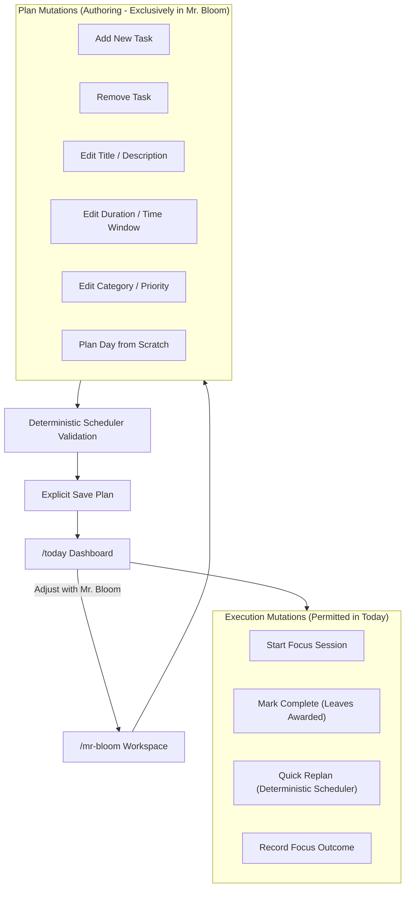
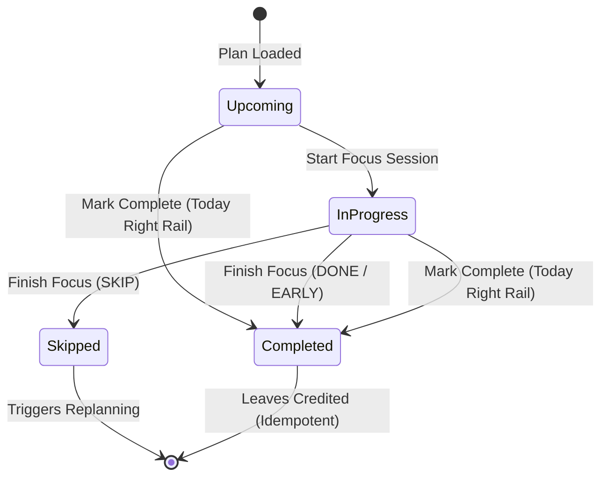

# Data Model: Refactor Today into an Execution-Only Dashboard

**Feature**: `028-today-execution-dashboard`  
**Date**: 2026-09-26  

---

## 1. Domain Entities & Roles

### 1.1 `DailyPlan` (Persisted Plan)
- **Role**: Authoritative daily schedule persisted in PostgreSQL.
- **Attributes**:
  - `id`: UUID (Primary Key)
  - `user_id`: UUID
  - `plan_date`: Date (`YYYY-MM-DD`)
  - `status`: `"ACTIVE" | "COMPLETED" | "ARCHIVED"`
  - `timezone_snapshot`: String (e.g., `"Asia/Ho_Chi_Minh"`, `"UTC"`)
  - `blocks`: Ordered list of `PlanBlock` entities
- **Lifecycle in Today**: Read-only display. Today never creates, alters, or replaces `DailyPlan` directly.

### 1.2 `PlanBlock` (Timeline Schedule Block)
- **Role**: Scheduled time interval belonging to a `DailyPlan`.
- **Attributes**:
  - `id`: UUID
  - `daily_plan_id`: UUID
  - `task_id`: UUID | null (null for `BREAK`, `BUFFER`, `FIXED_EVENT`)
  - `title`: String
  - `block_type`: `"TASK" | "BREAK" | "BUFFER" | "FIXED_EVENT"`
  - `planned_start_at`: ISO 8601 Timestamp
  - `planned_end_at`: ISO 8601 Timestamp
  - `status`: `"PLANNED" | "ACTIVE" | "COMPLETED" | "SKIPPED"`
  - `estimated_duration_minutes`: Integer
  - `category`: `"Learning" | "Work" | "Personal" | null`

### 1.3 `Task` (Domain Work Item)
- **Role**: Persistent task item containing metadata and execution progress.
- **Attributes**:
  - `id`: UUID
  - `user_id`: UUID
  - `title`: String (read-only in Today)
  - `description`: String | null (read-only in Today)
  - `estimated_duration_minutes`: Integer (read-only in Today)
  - `category`: `"Learning" | "Work" | "Personal" | null` (read-only in Today)
  - `status`: `"DRAFT" | "PENDING" | "IN_PROGRESS" | "COMPLETED" | "SKIPPED"`
  - `completed_at`: ISO 8601 Timestamp | null (set on completion)
- **Today Mutations**:
  - `status` transitions:
    - `"PENDING"` → `"IN_PROGRESS"` (when Focus starts)
    - `"PENDING"` / `"IN_PROGRESS"` → `"COMPLETED"` (when marked complete or focus concludes with DONE)

### 1.4 `TodayDraft` (Mr. Bloom Working Draft)
- **Role**: In-memory working draft manipulated in Mr. Bloom for authoring or structural adjustments.
- **Attributes**:
  - `type`: `"today"`
  - `planDate`: Date (`YYYY-MM-DD`)
  - `tasks`: List of `TaskDraft` (with `id`, `title`, `durationMin`, `category`, `importance`, `sourceTaskId`)
  - `availability`: List of `{ start: "HH:MM", end: "HH:MM" }`
  - `deferred_tasks`: List of deferred items
- **Invariants**:
  - Modifying any task in `TodayDraft` resets `preview` to `null`.
  - A timeline preview must be re-generated via the deterministic scheduler before saving.
  - Saving replaces the active `DailyPlan` via `/today/save`.

---

## 2. Mutation Classification

---

## 3. State Transitions for Tasks on Today

