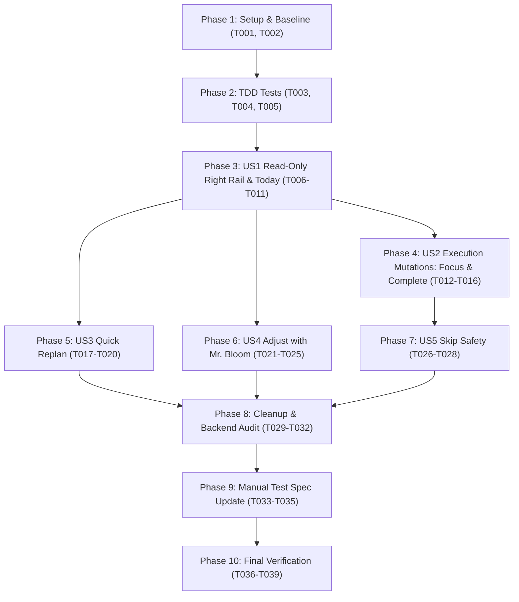

# Tasks: Refactor Today into an Execution-Only Dashboard

**Input**: Design documents from `specs/028-today-execution-dashboard/` (`spec.md`, `plan.md`, `research.md`, `data-model.md`, `contracts/`, `quickstart.md`)  
**Prerequisites**: `plan.md` (approved), `spec.md` (approved)  
**Tests**: TDD ordering applied to lock new read-only and execution behavior before component refactoring.

---

## Task Format & Conventions

- Format: `- [ ] [TaskID] [P?] [Story?] Description with file path`
- `[P]`: Can run in parallel (different files, no blocking dependencies).
- `[Story]`: Mapped to user story (`US1`, `US2`, `US3`, `US4`, `US5`) from `spec.md`.

---

## Phase 1: Setup & Pre-Implementation Baseline

**Purpose**: Verify the current test baseline and isolate baseline state before modifications.

- [x] T001 Run existing test suites for Today and Mr. Bloom to verify clean baseline before refactoring in `frontend/src/lib/features/today/` and `frontend/src/lib/features/mr-bloom/`
- [x] T002 [P] Verify backend route baseline by executing `pytest tests/api/test_today_routes.py tests/unit/test_today_service.py` in `backend/`

---

## Phase 2: Foundational (Locking Behavior with Tests — TDD First)

**Purpose**: Create test suites defining the execution-only and read-only contracts before editing UI components.

- [x] T003 [P] [US1] Create unit test suite `RightRail.test.ts` in `frontend/src/lib/features/today/components/organisms/RightRail.test.ts` asserting read-only rendering (no pencil icon, no edit inputs, no Save/Cancel buttons, no Delete button) and testing task selection display
- [x] T004 [P] [US1] Create unit test suite `BottomActions.test.ts` in `frontend/src/lib/features/today/components/organisms/BottomActions.test.ts` asserting absence of "EDIT MANUALLY" and presence of "QUICK REPLAN" and "ADJUST WITH MR. BLOOM"
- [x] T005 [P] [US2] Add execution action assertions in `RightRail.test.ts` in `frontend/src/lib/features/today/components/organisms/RightRail.test.ts` verifying "START FOCUS" and "MARK COMPLETE" buttons exist, are enabled for upcoming tasks, and disabled for completed tasks

**Checkpoint**: New tests are in place and failing (red) as expected until implementation in Phases 3-5.

---

## Phase 3: User Story 1 — Inspecting Schedule & Read-Only Right Rail (Priority: P1) 🎯 MVP

**Goal**: Deliver a read-only Today dashboard where users can inspect persisted schedules, timeline blocks, and task metadata with zero manual edit controls or risk of unvalidated modifications.

**Independent Test**: Load Today with mock or persisted plan; select tasks; verify all metadata fields are plain text, no edit toggles exist, and no direct delete controls exist.

### Implementation Tasks for User Story 1
- [x] T006 [US1] Remove edit mode state (`isEditing`, `editTitle`, `editDuration`, `editCategory`, `editDescription`, `startEditing`, `handleSave`) from `frontend/src/lib/features/today/components/organisms/RightRail.svelte`
- [x] T007 [US1] Remove edit toggle pencil button, form inputs (`<input>`, `<select>`, `<textarea>`), and Save/Cancel buttons from `frontend/src/lib/features/today/components/organisms/RightRail.svelte`
- [x] T008 [US1] Ensure task summary, time range, category badge, status badge, and notes copy render purely as static text in `frontend/src/lib/features/today/components/organisms/RightRail.svelte`
- [x] T009 [US1] Remove "EDIT MANUALLY" button and `onEdit` prop from `frontend/src/lib/features/today/components/organisms/BottomActions.svelte`
- [x] T010 [US1] Remove `rail?.startEditing()` and `handleSaveTask` from `frontend/src/routes/(app)/today/+page.svelte`
- [x] T011 [US1] Verify `RightRail.test.ts` and `BottomActions.test.ts` pass for read-only inspection

**Checkpoint**: Today and Right Rail are strictly read-only for metadata. MVP inspection is complete.

---

## Phase 4: User Story 2 — Executing Tasks & Recording Outcomes (Priority: P1)

**Goal**: Enable users to execute their schedule directly from Today by starting focus sessions and marking tasks complete with proper Leaf reward ledger credit.

**Independent Test**: Select an upcoming task; click "START FOCUS" (session begins, desktop widget syncs); click "MARK COMPLETE" (task turns completed, Leaf reward awarded via API, execution state saved).

### Implementation Tasks for User Story 2
- [x] T012 [US2] Add `"MARK COMPLETE"` button to `frontend/src/lib/features/today/components/organisms/RightRail.svelte` with disabled state when task is already completed, no task is selected, or selected block is a break
- [x] T013 [US2] Implement `handleMarkComplete(taskId: string)` in `frontend/src/routes/(app)/today/+page.svelte` calling `api.patch('/today/tasks/' + taskId + '/status', { status: 'COMPLETED' })`, updating local task state to `completed`, and emitting `desktop.scheduleUpdated()`
- [x] T014 [US2] Wire `onMarkComplete` prop from `+page.svelte` into `<RightRail />` in `frontend/src/routes/(app)/today/+page.svelte`
- [x] T015 [US2] Verify Start Focus presets (25/5, 50/10, Custom) and `onStartFocus` remain fully functional in `frontend/src/routes/(app)/today/+page.svelte` and `frontend/src/lib/features/today/components/organisms/RightRail.svelte`
- [x] T016 [US2] Add unit test cases for "MARK COMPLETE" interaction and task status update in `frontend/src/lib/features/today/TodayView.test.ts`

**Checkpoint**: Execution mutations (Start Focus, Mark Complete) work frictionlessly and award game resources correctly.

---

## Phase 5: User Story 3 — Quick Replanning for Execution Shifts (Priority: P2)

**Goal**: Provide a 1-click deterministic Quick Replan action on Today that rearranges remaining unfinished tasks from current time forward using the deterministic scheduler without conversational overhead.

**Independent Test**: On a day with uncompleted tasks, click "QUICK REPLAN"; verify `POST /today/replan?target_date=YYYY-MM-DD` is invoked and the timeline updates dynamically with recalculated start/end times.

### Implementation Tasks for User Story 3
- [x] T017 [US3] Add `"QUICK REPLAN"` button with `onQuickReplan` prop to `frontend/src/lib/features/today/components/organisms/BottomActions.svelte`
- [x] T018 [US3] Implement `handleQuickReplan()` in `frontend/src/routes/(app)/today/+page.svelte` calling `api.post('/today/replan')`, updating timeline blocks via `applySchedule(data)`, and surfacing unscheduled task warnings if any tasks overflow
- [x] T019 [US3] Wire `onQuickReplan` prop from `+page.svelte` to `<BottomActions />` in `frontend/src/routes/(app)/today/+page.svelte`
- [x] T020 [US3] Add unit test in `frontend/src/lib/features/today/TodayView.test.ts` verifying that clicking "QUICK REPLAN" calls `api.post('/today/replan')` and refreshes timeline data

**Checkpoint**: Deterministic schedule realignment is available directly within Today.

---

## Phase 6: User Story 4 — Handing Off Structural Plan Modifications to Mr. Bloom (Priority: P1)

**Goal**: Transition seamlessly from Today to Mr. Bloom when the user needs to alter plan structure, carrying the plan date and selected task context into a scheduler-validated draft editing flow.

**Independent Test**: Click "ADJUST WITH MR. BLOOM" from a selected task in Right Rail (or from Bottom Actions); verify Mr. Bloom opens with the plan loaded into `TodayDraft`; make an edit; verify timeline preview generation is required before explicit save; save and verify return to `/today`.

### Implementation Tasks for User Story 4
- [x] T021 [US4] Add `"ADJUST WITH MR. BLOOM"` button to `frontend/src/lib/features/today/components/organisms/RightRail.svelte` calling `onAdjustWithMrBloom(task.task_id)`
- [x] T022 [US4] Update Bottom Actions replan button in `frontend/src/lib/features/today/components/organisms/BottomActions.svelte` to label `"ADJUST WITH MR. BLOOM"` calling `onAdjustWithMrBloom`
- [x] T023 [US4] Implement `handleAdjustWithMrBloom(taskId?: string)` in `frontend/src/routes/(app)/today/+page.svelte` navigating to `/mr-bloom?date=${planDate}` (appending `&taskId=${taskId}` if provided)
- [x] T024 [US4] Update `frontend/src/lib/features/mr-bloom/stores/mrBloomStore.ts` (in `restoreLatestSession` or init logic) to detect URL query parameters `date` and `taskId`: if `date` is present and differs from current draft, load `/today?date=...` into a `TodayDraft` with `preview: null` and `previewMode: 'today'`
- [x] T025 [US4] Add test in `frontend/src/lib/features/today/TodayView.test.ts` asserting navigation to `/mr-bloom` with date and taskId parameters when "ADJUST WITH MR. BLOOM" is clicked

**Checkpoint**: Structural changes pass exclusively through Mr. Bloom with deterministic scheduler verification before save.

---

## Phase 7: User Story 5 — Handling Task Skips Consistently (Priority: P2)

**Goal**: Ensure task skipping never leaves an unadjusted, stale gap in the timeline by verifying all skip paths integrate with focus outcomes and deterministic replanning.

**Independent Test**: Verify concluding a focus session with outcome "SKIP" calls the replan flow; confirm no orphan skip action exists on the Today timeline.

### Implementation Tasks for User Story 5
- [x] T026 [US5] Verify and assert that no standalone un-replanned skip button or action exists in `frontend/src/lib/features/today/`
- [x] T027 [US5] Verify that focus session conclusion with outcome `"SKIP"` in `frontend/src/routes/widget/+page.svelte` triggers `/today/replan` and updates the schedule
- [x] T028 [US5] Add unit test in `frontend/src/lib/features/today/TodayView.test.ts` verifying that skipped tasks display with appropriate skipped status styling on the timeline without allowing manual in-place edit

**Checkpoint**: Schedule timeline integrity is preserved across all execution outcomes.

---

## Phase 8: Frontend Cleanup & Backend Dependency Verification

**Purpose**: Eliminate unused types, imports, and dead code while safely verifying backend endpoints.

- [x] T029 [P] Deprecate or remove unused `TodayTaskEdit` import and types from `frontend/src/lib/api/types.ts` and `frontend/src/routes/(app)/today/+page.svelte`
- [x] T030 [P] Clean up any dead CSS rules related to edit form controls (`.category-select`, `.notes-textarea`, `.edit-toggle`) in `frontend/src/lib/features/today/components/organisms/RightRail.svelte`
- [x] T031 [P] Perform final backend caller check on `PATCH /today/tasks/{task_id}` in `backend/app/api/routes/today.py` to confirm it is not called by any active frontend component, leaving the endpoint documented as retained for compatibility
- [x] T032 [P] Verify that `DELETE /today/tasks/{task_id}` is confirmed absent from `backend/app/api/routes/today.py`

---

## Phase 9: Manual Test Specification Update & Quality Gates

**Purpose**: Update test documentation to reflect the new execution-only product reality.

- [x] T033 Update `docs/testing/Blooming-Manual-Test-Scenarios.md` to replace obsolete case `TODAY-UI-03 — Edit Task Metadata Directly from Today Right Rail` with `TODAY-UI-03 — Today Task Details Are Read-Only`
- [x] T034 Add manual test scenario `Adjust Existing Plan with Mr. Bloom` to `docs/testing/Blooming-Manual-Test-Scenarios.md` documenting navigation with date/taskId, draft modification, scheduler timeline preview, and save
- [x] T035 Add manual verification steps for `Quick Replan` and `Mark Complete` to `docs/testing/Blooming-Manual-Test-Scenarios.md`

---

## Phase 10: Final Verification & Integration Validation

**Purpose**: Full regression suite run and end-to-end validation.

- [x] T036 Run all frontend unit and component tests: `npm test` in `frontend/`
- [x] T037 Run all backend tests: `pytest` in `backend/`
- [x] T038 Execute the runnable scenarios defined in `specs/028-today-execution-dashboard/quickstart.md`
- [x] T039 Verify TypeScript compilation and linting: `npm run check` in `frontend/`

---

## Dependencies & Execution Order

### Parallel Opportunities

- **T003, T004, T005**: All test scaffolding tasks can be authored in parallel.
- **T012 & T017**: "Mark Complete" and "Quick Replan" button additions in `RightRail` and `BottomActions` can be implemented in parallel once US1 read-only refactor lands.
- **T029, T030, T031, T032**: All cleanup and audit verification tasks can run in parallel.
- **T033, T034, T035**: Documentation updates can run in parallel with cleanup tasks.

---

## Implementation Strategy: MVP First

1. **Step 1 (MVP)**: Complete Phase 1, Phase 2, and Phase 3. Today is now strictly read-only with no edit or delete controls. Validate independently via `RightRail.test.ts` and `BottomActions.test.ts`.
2. **Step 2 (Execution Actions)**: Complete Phase 4 ("Mark Complete" + "Start Focus"). Users can execute their day and earn Leaves/Water.
3. **Step 3 (Replan & Bloom Integration)**: Complete Phase 5 ("Quick Replan") and Phase 6 ("Adjust with Mr. Bloom"). Users can realign schedules and author plan modifications safely.
4. **Step 4 (Polish & Verify)**: Complete Phases 7, 8, 9, and 10 to ensure zero dead code, clean documentation, and green test passes.
